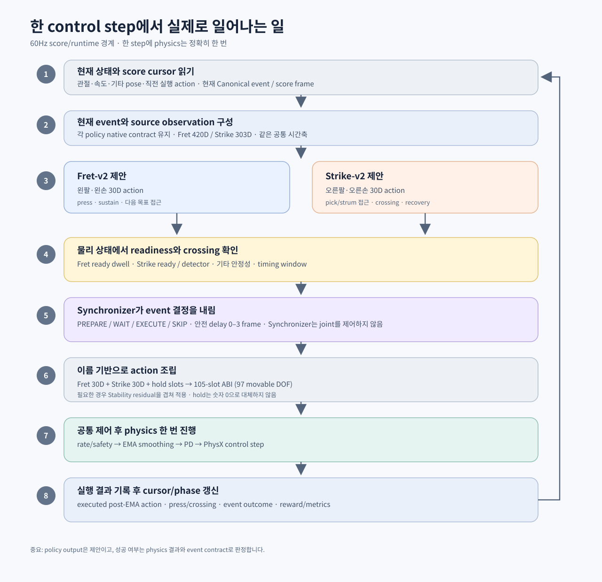

# 1. 전체 구조: 무엇이 어디서 결정되는가

## 1.1 핵심 그림

프로젝트는 크게 네 층으로 나뉩니다.

```text
┌─────────────────────────────────────────────┐
│ ① 오프라인 의미 계층                         │
│ 음원 → 음표/탭/핑거링/코드/타현 계획          │
└──────────────────────┬──────────────────────┘
                       │ 검토된 song bundle
          ┌────────────┴────────────┐
          ▼                         ▼
┌──────────────────┐       ┌──────────────────┐
│ ② Fret skill     │       │ ② Strike skill  │
│ 왼손 압현 prior   │       │ 오른손 타현 prior │
└────────┬─────────┘       └────────┬─────────┘
         │ 제안 action              │ 제안 action
         └────────────┬─────────────┘
                      ▼
┌─────────────────────────────────────────────┐
│ ③ 실행 감독 계층                             │
│ Canonical PlayEvent + ScoreClock + Synchronizer│
│ readiness / detector / timing / delay / hold │
└──────────────────────┬──────────────────────┘
                       ▼
┌─────────────────────────────────────────────┐
│ ④ 물리 계층                                  │
│ 사람 + 기타 + 의자 + 스트랩 + 중력 + 접촉     │
│ action → EMA → PD → PhysX → 실제 결과        │
└─────────────────────────────────────────────┘
```

안정화는 ③과 ④ 사이에 추가되는 보정 계층입니다. 몸과 하체, 지지 팔의 residual을 만들어 기존 연주 정책이 기타를 떨어뜨리지 않도록 돕습니다.

## 1.2 세 가지 축으로 이해하기

### 데이터 축: “무슨 음악을 연주할까?”

음원과 주석에서 다음 의미를 만듭니다.

```text
audio
  → notes
  → tablature: string + fret + time
  → left-hand fingering
  → right-hand strike/strum plan
  → canonical play events
```

이 축의 결과는 “어느 시점에 어떤 줄을 어떤 프렛으로 연주해야 하는가”입니다.

### 제어 축: “어떻게 몸을 움직일까?”

Fret과 Strike 정책은 목표를 보고 관절 action을 제안합니다.

- Fret은 왼손 압현에 필요한 왼팔·왼손을 담당합니다.
- Strike는 오른손 타현에 필요한 오른팔·오른손을 담당합니다.
- Stability는 몸·하체·팔 지지를 담당하는 residual을 설계합니다.
- Synchronizer는 관절을 소유하지 않고, 언제 실행할 수 있는지 결정합니다.

### 시간 축: “언제 성공으로 기록할까?”

모든 event는 공통 60Hz score clock을 사용합니다.

- physics는 매 control step에 한 번 진행합니다.
- event cursor는 한 step에서 한 번만 판단·전진합니다.
- 정책이 늦었다고 score clock을 멈추지 않습니다.
- 미리 준비하는 pre-roll과 event의 실행 시점을 분리합니다.

## 1.3 오프라인 경로와 온라인 경로

### 오프라인 경로

오디오를 읽고, 모델·규칙·검색을 이용해 음악 표현을 만듭니다.

```text
오디오
  → Conformer tablature transcription
  → ACE 보조 음원/구간 정보
  → chordtrack 융합
  → fingering allocation / beam search
  → strike plan compiler
  → 검토된 data/song_bundles/<song_id>/
```

오프라인 단계는 물리 시뮬레이터를 실행하지 않습니다. 결과를 사람이 검토한 후 학습의 정식 입력으로 승격합니다.

### 온라인 경로

학습 또는 실행 시에는 정리된 bundle을 읽고 매 60Hz step마다 다음을 반복합니다.

```text
상태 읽기
  → 현재/다음 event 찾기
  → Fret·Strike observation 만들기
  → 각 source policy가 action 제안
  → Fret readiness / Strike detector / 기타 안정성 측정
  → Synchronizer가 실행·대기·skip·delay 결정
  → Stability residual과 hold를 결합
  → 105-slot action ABI에 관절별로 배치
  → 공통 EMA와 PD 제어
  → PhysX 한 step
  → crossing·contact·reward·log 기록
  → cursor와 phase 갱신
```

## 1.4 모듈별 책임 표

| 모듈 | 결정하는 것 | 결정하지 않는 것 | 주요 산출물 |
|---|---|---|---|
| Stage 1 | 음표, 시간, 탭 후보, 코드, 손가락 후보 | 관절 torque, 실제 타현 성공 | mapping 파일 |
| Fret | 왼손 관절 목표/동작 제안 | 타현 permission, 전체 몸 안정성 | 30D action, readiness 관련 신호 |
| Strike | 오른손 관절 목표/동작 제안 | 왼손 압현의 음악적 정답, score cursor | 30D action, crossing 결과 |
| Synchronizer | event 실행/대기/skip, delay, permission | 관절을 직접 움직이는 것 | decision/result |
| Stability | 몸·하체·팔 지지 residual | 왼손·오른손 손가락 action | 43D residual 설계 |
| Action Arbiter | named slot 배치와 hold | 물리 성공 여부 | 105-slot full action ABI (97 movable DOF) |
| 공통 환경 | EMA, PD, 물리 계산, reset | 음악적 event의 의미 | 다음 상태, 접촉·동역학 결과 |

## 1.5 최종 전신 action의 구조

현재 전체 action 벡터는 105개의 이름 있는 slot으로 약속합니다. 이 중 8개는 zero-range 고정축이므로 실제 이동 가능한 축은 97개입니다.

```text
Fret:       왼쪽 어깨 3 + 왼쪽 팔꿈치 3 + 왼쪽 손목 3 + 왼손 21 = 30
Strike:     오른쪽 어깨 3 + 오른쪽 팔꿈치 3 + 오른쪽 손목 3 + 오른손 21 = 30
Stability:  몸통/하체/팔 지지에 사용되는 슬롯을 별도 보정
Hold:       위 모듈이 소유하지 않는 나머지 45개 슬롯
---------------------------------------------------------------
합계                                                        105
```

따라서 “action 벡터 길이 105”와 “실제 이동 자유도 97”은 서로 다른 수치입니다. 105-slot ABI는 모듈 간 이름·순서를 안정적으로 맞추기 위해 고정축도 포함하며, 8개 zero-range 축은 움직이지 않습니다.

## 1.6 실행 한 번의 상세 순서

아래 순서는 전체 결합을 구현할 때 특히 중요합니다.



1. 이전 physics 결과와 현재 관절·기타 상태를 읽습니다.
2. score clock의 현재 frame에서 처리할 event를 확인합니다.
3. Fret/Strike source policy에 각자의 계약에 맞는 observation을 넣습니다.
4. 두 정책이 독립적으로 30D action을 제안합니다.
5. 왼손은 목표 프렛·압현·sustain을 기준으로 readiness를 계산합니다.
6. 오른손은 실제 pick point의 swept crossing을 기준으로 타현 결과를 계산합니다.
7. 기타의 위치·회전·속도가 안정 조건을 만족하는지 확인합니다.
8. Synchronizer가 `PREPARE`, `WAIT`, `EXECUTE`, `SKIP`, `RESOLVED` 중 하나를 결정합니다.
9. Stability residual과 소유되지 않은 축의 hold를 적용합니다.
10. 각 source action을 이름 기반으로 105-slot ABI에 scatter합니다. 실제 movable DOF는 97개입니다.
11. 하나의 공통 EMA smoothing과 PD target/torque 변환을 적용합니다.
12. PhysX를 정확히 한 번 진행합니다.
13. crossing, contact, event outcome, reward, metrics를 기록합니다.
14. event cursor와 다음 phase를 갱신합니다.

## 1.7 설계 원칙

- **음악 의미와 joint control을 분리**합니다.
- **모든 모듈이 같은 시간축**을 봅니다.
- 기타의 음악적 위치는 기타 기준 좌표 `G`, 몸의 지지는 pelvis 기준 `B`, 중력·낙하는 world 기준 `W`에서 판단합니다.
- actor의 의도보다 **실제로 일어난 물리 결과**를 우선합니다.
- 기존 Fret·Strike skill을 보존한 후 안정화 계층을 추가합니다.
- 안정화는 손가락 소유권을 빼앗지 않고, 몸과 지지 계층부터 엽니다.
- 물리 모드 변경은 단순 설정 변경이 아니라 checkpoint migration 문제로 취급합니다.
