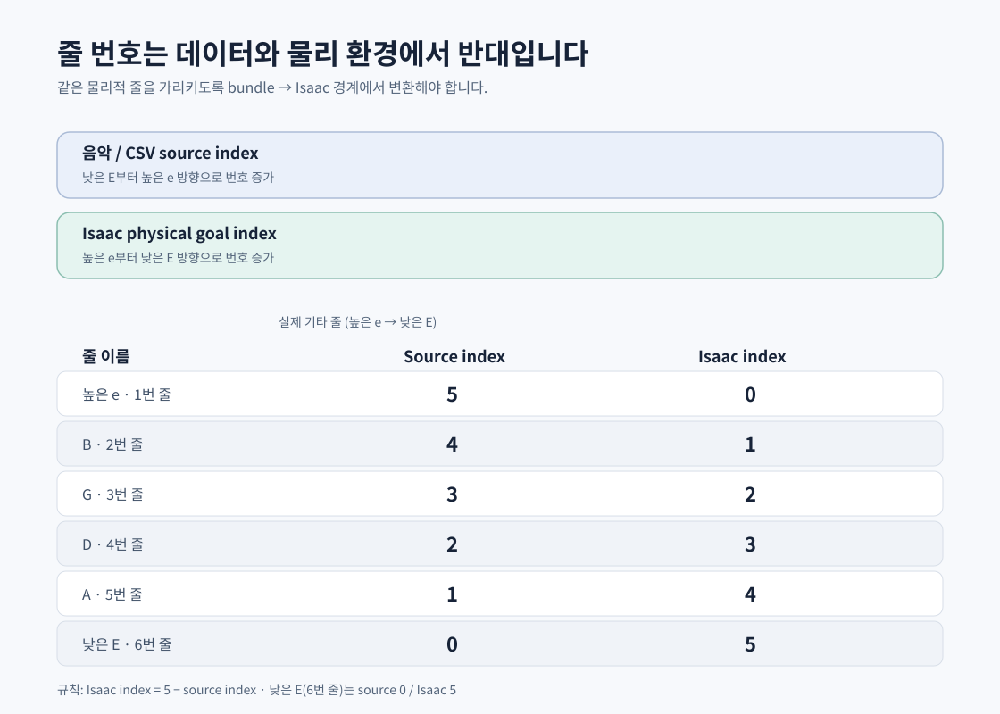

# 2. 오디오에서 학습 데이터까지

## 2.1 Stage 1의 역할

`tab2fingermapping`은 오디오를 바로 관절 action으로 바꾸는 모듈이 아닙니다. 오디오에서 음악적으로 의미 있는 중간 표현을 만들고, 사람이 검토할 수 있는 형태로 정리하는 **오프라인 전처리 단계**입니다.

```text
audio.wav
  ├─ Conformer → notes.csv
  ├─ ACE       → .lab
  ├─ chordtrack(notes + ACE) → chords.json
  └─ fingermapping(notes + chords) → fingering.json
                                  └→ notes.json
```

일반 실행 예시는 다음과 같습니다.

```bash
conda activate tab2fm
cd tab2fingermapping
python pipeline.py /path/to/audio.wav --bpm 117
```

기본 출력은 오디오 파일 옆의 `<stem>_stage1/`에 생성됩니다.

## 2.2 각 Stage 1 모듈의 입력과 출력

| 단계 | 입력 | 처리 | 출력 |
|---|---|---|---|
| Conformer | 오디오, 샘플레이트, 모델 설정 | onset/offset, pitch, 줄 후보 추정 | `*.notes.csv` |
| ACE | 오디오 | 음성/음원 구간 또는 보조 활성도 추정 | `*.lab` |
| chordtrack | Conformer 예측, ACE 결과 | 시간 필터와 규칙·모델 결과 융합 | `*.chords.json` |
| fingermapping | 음표, 코드, 기타 운지 규칙 | 가능한 grip, melody, barre 후보를 검색 | `*.fingering.json` |
| csv_to_notejson | notes CSV, BPM 등 | 학습용 note event 형태로 변환 | `*.notes.json` |

Conformer의 예측 결과는 chordtrack에서 다시 사용합니다. 따라서 같은 오디오를 매번 독립적으로 다시 추론하는 구조가 아니라, 한 번 얻은 중간 결과를 다음 단계가 소비하는 구조입니다.

## 2.3 TablatureSong: 음악의 공통 입력

Stage 1의 핵심 결과는 다음 의미를 갖습니다.

```json
{
  "song_id": "예시_song",
  "tuning": "standard",
  "tempo_map": [],
  "fps": 60,
  "notes": [
    {
      "note_id": "n0001",
      "onset_s": 1.25,
      "offset_s": 1.70,
      "pitch": 64,
      "string_index": 2,
      "fret_index": 5,
      "velocity": 0.8,
      "confidence": 0.93
    }
  ],
  "chord_groups": [],
  "schema_version": "..."
}
```

위 예시는 형식을 이해하기 위한 축약본입니다. 중요한 것은 다음입니다.

- `onset_s`, `offset_s`: 음이 시작하고 끝나는 음악 시간
- `pitch`: 실제 음높이
- `string_index`, `fret_index`: 기타에서 낼 위치
- `velocity`, `confidence`: 세기 또는 추정 신뢰도
- `chord_groups`: 동시에 처리해야 하는 음들의 묶음
- `source_hash`, `schema_version`: 어떤 입력과 형식으로 만들었는지 추적하는 정보

Stage 1은 “어느 손가락 관절을 얼마만큼 움직일지”를 출력하지 않습니다. 또한 오른손의 down/up 방향, 실제 타현 성공, 기타 지지 여부도 최종적으로 결정하지 않습니다.

## 2.4 손가락 매핑은 왜 별도인가

같은 음을 기타에서 여러 방식으로 낼 수 있습니다. 예를 들어 같은 pitch가 여러 줄·프렛 조합에 존재할 수 있고, 같은 chord라도 여러 grip이 가능합니다. 따라서 다음을 별도 최적화합니다.

1. 해당 음을 낼 수 있는 string/fret 후보를 만듭니다.
2. 열린 줄, 일반 grip, CAGED 형태, power chord, barre 후보를 만듭니다.
3. 멜로디 음이나 chord의 필수 음이 빠지지 않는지 확인합니다.
4. 이전 event에서의 손 위치와 이동 비용을 계산합니다.
5. beam search로 전체 구간의 비용이 낮은 후보를 선택합니다.
6. 그래도 할당되지 않는 음은 실패 이유와 함께 남깁니다.

결과는 단순한 “손가락 번호”가 아니라, 손가락 번호·누르기 시작/해제 시각·sustain·손 위치 목표·transition cost를 포함하는 Fret 입력이 됩니다.

## 2.5 손가락 번호와 줄 번호: 가장 자주 틀리는 부분

이 프로젝트에는 서로 다른 좌표 규약이 있습니다.

### 음악/CSV와 Isaac 물리 규약

두 규약은 반대 방향으로 번호를 매깁니다.



변환은 `isaac_string = 5 - source_string`입니다. 이 변환은 `CanonicalStringTarget`에 보존됩니다. CSV의 `string=0`을 물리 환경에서 그대로 `string=0`으로 사용하면 완전히 반대 줄을 가리키므로, 데이터 로더와 compiler 경계를 확인해야 합니다.

### 손가락 번호

| 값 | 의미 |
|---:|---|
| 0 | 손가락 없음: open 또는 미지정 |
| 1 | 검지 |
| 2 | 중지 |
| 3 | 약지 |
| 4 | 소지 |

프렛 encoding은 보통 `0=don’t-care`, `-1=open/no press`, `1 이상=해당 프렛을 누름`으로 해석합니다. “프렛 번호 0”과 “이번 관측에서 상관없음”은 데이터 구조에 따라 다른 의미가 될 수 있으므로 필드의 contract를 봐야 합니다.

## 2.6 song bundle: 학습의 정식 입력

Stage 1의 `_stage1`이나 `_gen`은 작업 결과를 임시로 모아두는 공간입니다. 학습은 사람이 검토한 canonical bundle을 사용합니다.

```text
data/song_bundles/<song_id>/
├── source/
│   ├── audio.wav
│   └── annotation.jams
├── mapping/
│   ├── tablature.notes.csv
│   ├── fingering.json
│   ├── chords.json
│   └── notes.json
├── training/
│   ├── fret_training.json
│   ├── hand_position_targets.json
│   ├── strike_training.json
│   └── strike_plan.json
├── preview/fingering.png
└── manifest.json
```

각 파일의 역할은 다음과 같습니다.

- `source`: 원본과 주석. 재현성과 검토의 기준입니다.
- `mapping`: 음악 의미와 손가락 배정입니다.
- `fret_training.json`: 60Hz 시간축으로 rasterize한 왼손 목표입니다.
- `hand_position_targets.json`: 손 위치 전환과 anchor 정보입니다.
- `strike_training.json`: 타현의 원시 event 또는 문자열 목표입니다.
- `strike_plan.json`: single pick/strum의 순서, 방향, traversal, offset, sweep 정보를 갖는 컴파일 입력입니다.
- `manifest.json`: schema, source hash, 생성 정보, capability/audit 결과를 추적합니다.

## 2.7 Fret branch와 Strike branch

운지까지 만든 뒤 두 branch로 나눕니다.

```text
검토된 TablatureSong
       │
       ├─ FingerMapping → FretEvent → Fret-v2 학습
       │
       └─ Picking/Strum compiler → StrikeEvent → Strike-v2 학습
```

Fret branch는 “어떤 음을 누르고 유지해야 하는가”에 집중합니다. Strike branch는 “어느 줄들을 어떤 방향·순서로 가로질러 소리를 낼 것인가”에 집중합니다. 두 branch가 같은 음원을 보더라도 입력 schema와 성공 판정이 다릅니다.

## 2.8 음원 품질을 확인하는 순서

새 곡을 추가할 때는 아래 순서로 확인합니다.

1. source audio와 annotation이 존재하는가?
2. 모든 note의 시간·string·fret이 유효한가?
3. fingering 결과에서 할당 실패가 남아 있지 않은가?
4. fret training이 60Hz로 생성되었는가?
5. strike plan이 unsupported restrike나 방향 모호성을 fail-closed로 표시하지 않는가?
6. manifest의 hash와 schema가 현재 loader가 허용하는가?
7. 먼저 Fret/Strike 각각의 평가를 하고, 그 뒤 G0 결합 입력으로 승격할 것인가?

정식 bundle은 “파일이 있다”는 이유만으로 안전한 입력이 아닙니다. mapping과 strike plan의 음악적 의미를 사람이 검토하고, compiler의 capability/audit 결과까지 확인해야 합니다.
