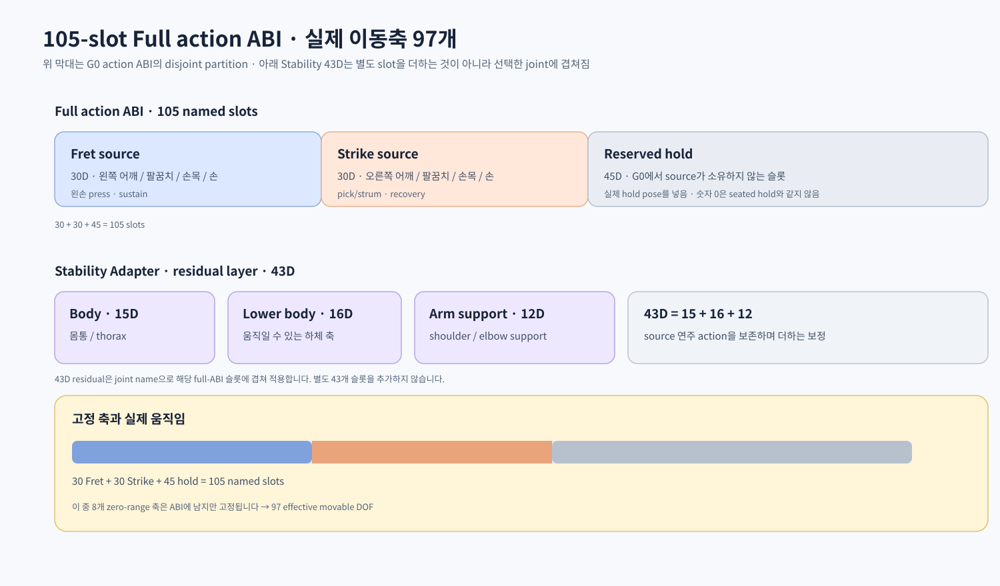

# 6. G0: Fret과 Strike를 하나의 연주 사건으로 결합하기

## 6.1 G0의 목적

G0는 “두 정책이 각각 잘 움직이는가?”에서 한 단계 나아가 “같은 score time에서 왼손과 오른손이 같은 음악 event를 처리하는가?”를 검증하는 단계입니다.

G0의 기본 조건:

- 기타는 고정합니다.
- Fret source policy와 Strike source policy를 보존합니다.
- 둘을 하나의 score clock과 event cursor에 연결합니다.
- 왼손 readiness, 오른손 실제 crossing, 기타 안정성을 함께 봅니다.
- 모듈별 action을 이름 기반 105-slot action ABI로 합칩니다. 이 중 97개만 실제 movable DOF입니다.
- 물리 step은 한 번만 진행합니다.

G0는 최종 전신 연주가 아닙니다. 자유 기타·스트랩·안정화까지 포함하는 것은 G1/G2의 책임입니다.

## 6.2 Canonical PlayEvent

Fret training과 Strike training의 원시 형식을 그대로 runtime에서 동시에 사용하면 시간·줄 번호·event grouping이 어긋날 수 있습니다. 그래서 두 skill이 공통으로 이해할 수 있는 Canonical PlayEvent를 컴파일합니다.

한 event가 갖는 정보는 개념적으로 다음과 같습니다.

```text
event_id
score_time / score_frame
chord_id 또는 event group
  ├─ Fret projection
  │    ├─ string, fret, finger
  │    ├─ press / release / sustain
  │    └─ readiness window
  └─ Strike projection
       ├─ gesture
       ├─ traversal mask
       ├─ audible/protected mask
       ├─ direction / offsets
       └─ sweep / recovery
+ guitar stability requirement
+ source event ids / capability status
```

Canonical target에는 source string과 Isaac string을 모두 보존합니다.

```text
source string: 0=낮은 E, …, 5=높은 e
Isaac string:  0=높은 e, …, 5=낮은 E
변환: Isaac string = 5 - source string
```

이렇게 해야 offline mapping과 물리 detector가 서로 다른 줄을 보게 되는 실수를 찾을 수 있습니다.

## 6.3 하나의 ScoreClock

CanonicalScoreClock가 score time을 관리하는 유일한 mutable cursor입니다.

```text
pre-roll frame < 0
       │
       ▼
event 0 → event 1 → event 2 → ...
```

원칙은 다음과 같습니다.

- physics control step마다 score frame은 한 번만 진행합니다.
- 현재 event가 늦어도 score clock을 멈추지 않습니다.
- Synchronizer가 현재 event를 정확히 한 번 resolve한 뒤 cursor를 전진시킵니다.
- event를 두 번 처리하거나, reset 중에 같은 event를 재실행하지 않습니다.
- event가 시작하기 전의 음수 frame은 pre-roll로 사용할 수 있습니다.

정책의 “아직 준비가 안 됐으니 시간을 멈추자”는 의도와, 공통 시간축이 실제로 진행되는 것은 다른 문제입니다. 늦은 경우에는 WAIT, safe delay, 또는 miss를 기록합니다.

## 6.4 Synchronizer는 관절을 소유하지 않는다

Synchronizer는 left/right joint를 직접 제어하지 않습니다. 매 step에 다음을 입력으로 받습니다.

- 현재 Canonical event
- score frame과 timing window
- Fret readiness
- Strike ready/detector 상태
- guitar stable 여부
- 이전 event outcome
- 다음 event와 rearm/delay 여유

그 결과로 다음을 결정합니다.

- 지금 준비할지
- 실행할지
- 기다릴지
- event를 skip할지
- 몇 frame delay할지
- 어떤 string을 traversal/scrorable로 허용할지
- Fret/Strike에 전달할 hold 또는 context
- event outcome과 delay cause

결정 상태는 개념적으로 다음과 같습니다.

```text
PREPARE → WAIT → EXECUTE → RESOLVED
                       └→ SKIP
```

실제 event outcome은 다음처럼 구분됩니다.

- "ACTIVE": 아직 처리 중
- "FULL": 필요한 부분이 모두 성공
- "PARTIAL": 일부만 성공
- "MISSED_FRET": 왼손 목표 실패
- "MISSED_STRIKE": 오른손 타현 실패
- "MISSED_BOTH": 둘 다 실패
- "MISSED_STABILITY": 안정성 조건 때문에 실행 불가

이 구분 덕분에 “오른손이 틀렸는지, 왼손이 늦었는지, 기타가 불안정했는지”를 한 개의 miss 숫자로 뭉개지 않고 분석할 수 있습니다.

## 6.5 readiness dwell과 safe delay

현재 Fret readiness는 한 순간의 위치 확인이 아니라 짧은 dwell을 요구합니다. 기본 dwell 1은 첫 번째 frame boundary에서 dwell을 시작하고, 그 사이의 완전한 control frame을 거친 뒤 다음 boundary에서 확인하는 의미입니다. 즉, 연속된 두 경계에서 목표가 맞아야 하는지 확인해야 하므로 off-by-one을 조심해야 합니다.

Strike permission은 보통 다음의 AND 조건입니다.

```text
permit strike
  = event에 strike가 필요함
    AND Fret ready dwell
    AND Strike ready
    AND guitar stable
    AND timing window
```

Fret과 Strike가 준비되지 않았을 때 Synchronizer는 event-specific safe delay를 허용할 수 있습니다. 기본 최대 delay는 0~3 frame이며, 60Hz에서 3 frame은 약 50ms입니다. 단, 다음 event의 timing, rearm slack, event deadline을 넘겨서는 안 됩니다.

delay의 원인은 반드시 기록해야 합니다. 같은 최종 성공이라도 “원래 제때 실행”과 “3 frame 늦게 실행”은 품질이 다릅니다.

## 6.6 Source policy를 결합할 때 observation을 보존하는 법

Fret과 Strike source policy는 자신이 학습한 native observation contract를 그대로 기대합니다. G0 runtime은 여기에 결합 문맥을 주입하되, source 정책의 입력 구조를 임의로 다시 설계하지 않습니다.

특히 다음이 중요합니다.

- Fret의 Synchronizer context는 source 학습 분포를 보존하기 위해 기본 "(release_enable=1, timing_offset=0)"을 유지합니다.
- Strike에는 event timing shift가 event field에 반영됩니다.
- 이전 action history에는 raw proposal이 아니라 실제 실행된 post-EMA action을 넣어야 합니다.
- checkpoint는 model state뿐 아니라 contract, asset fingerprint, source hash를 검증해야 합니다.
- source policy는 eval/no-grad로 실행하고, frozen integrity를 확인합니다.

따라서 G0의 supervisor가 delay를 관리한다고 해서 Fret policy observation에 임의의 새로운 delay 차원을 끼워 넣는 것이 아닙니다.

## 6.7 105-slot named action ABI · 실제 이동축 97개

최종 action은 배열의 숫자 위치만 믿지 않고 joint name으로 조립합니다.



```text
Fret policy 30D ──┐
                  ├─ named scatter ─→ full action vector 105 slots
Strike policy30D ─┘
Stability/hold ───┘
```

manifest는 다음을 명시합니다.

- Fret이 소유하는 정확한 30개 이름
- Strike가 소유하는 정확한 30개 이름
- reserved hold slot
- joint name에서 full action index로 가는 mapping
- zero-range fixed axis

모듈별 ownership은 다음과 같습니다.

| 모듈 | 소유 영역 |
|---|---|
| Fret | 왼쪽 어깨·팔꿈치·손목·왼손 |
| Strike | 오른쪽 어깨·팔꿈치·손목·오른손 |
| Stability | 몸통·하체·지지용 팔 residual |
| Gaze(후속) | 목·머리 |
| Synchronizer | 관절 없음; 실행 permission과 timing만 |

소유하지 않는 slot은 hold해야 합니다. 여기서 숫자 0은 일반적으로 control midpoint이지 seated pose가 아닙니다. 따라서 실제 hold는 초기 seated action 또는 직전 실행 action에서 계산해야 합니다.

## 6.8 action merge와 물리 경계

최종 실행 경계의 순서는 다음입니다.

```text
source action transform
  → named action scatter
  → stability residual merge
  → total cap / safety mask / rate limit
  → 공통 EMA
  → PD
  → physics
```

Fret에 한 번 EMA를 적용하고, Strike에 또 한 번 EMA를 적용한 뒤 full action에 다시 smoothing하는 식으로 중복 적용하면 학습 때와 실행 때의 dynamics가 달라집니다.

## 6.9 FullG0 one-step boundary

현재 FullG0TaskController는 다음 인터페이스를 정의합니다.

1. Fret postprocess가 있으면 준비합니다.
2. physics 이전 runtime이 decision과 full action을 만듭니다.
3. callback을 통해 simulator를 정확히 한 번 실행합니다.
4. FullG0PhysicsSnapshot을 받습니다.
5. executed post-EMA action을 commit합니다.
6. physics 이후 runtime이 crossing, readiness, outcome을 처리합니다.

snapshot에는 다음이 포함됩니다.

- executed full action [N, 105]
- crossing mask [N, 6]
- crossing subframe time [N, 6]
- crossing direction [N, 6]
- fret ready mask [N, 6]

여기서 executed_full_action은 policy가 원래 제안한 action이 아니라, 실제 공통 EMA 이후 실행된 action입니다.

## 6.10 현재 구현 범위

현재 구현된 경계:

- Canonical event compiler와 source hash
- one clock / one cursor / exactly-once event resolution
- Fret readiness와 1-frame dwell
- event별 0~3 frame safe delay
- 실제 crossing·방향·순서·unplanned crossing 기록
- Fret-v2/Strike-v2 strict source loader
- 105-slot named action manifest와 CPU runtime (zero-range 8축 포함, movable 97축)
- frozen source pair와 CPU integration probe

아직 다음이 남아 있습니다.

- 하나의 Isaac simulator에서 실행되는 물리 FullG0Task
- source observation parity의 simulator 검증
- current-pose hold/entry-side physics gate
- collision filter audit
- 조건을 만족하는 full-song source pair
- fixed-guitar physical G0 smoke와 deterministic evaluation/video
- 자유 기타 G1, Stability Adapter G2 학습

tab2body.train --task full 또는 train_full.py의 현재 interface probe는 위 CPU 결합 경계를 검사할 수 있지만, 그 자체가 하나의 Isaac simulator에서 전신 연주가 검증되었다는 뜻은 아닙니다.

## 6.11 코드 읽기 지도

- G0 개요: ../../tab2body/full/README.md
- Canonical event: ../../tab2body/full/events.py
- Score clock: ../../tab2body/full/clock.py
- Synchronizer: ../../tab2body/full/synchronizer.py
- action ABI: ../../tab2body/full/action.py
- source policy loader: ../../tab2body/full/source_policies.py
- one-step controller: ../../tab2body/env/tasks/task_full.py
- Full CLI/probe: ../../tab2body/train_full.py
- 상위 설계: ../../master_plan/07_full_body_player.md, ../../master_plan/08_shared_contracts.md
