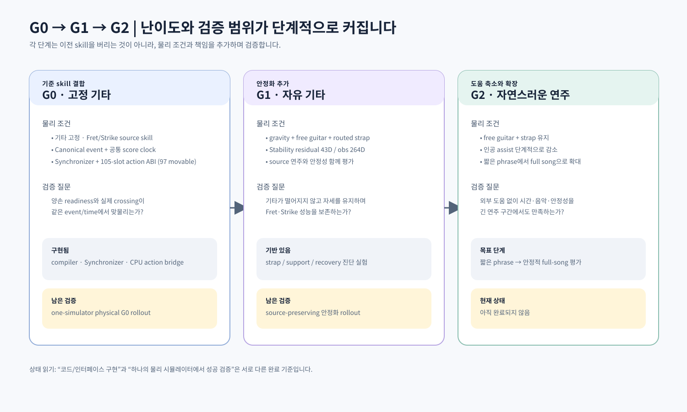

> **이전 설계·실험 설명.** 아래 독립 실험과 차원은 작성 당시 기준이다. 현재 단일 과제의 실행·관측·검증 상태는 [StabilityAdapter](../../stability_adapter/README.md)를 따른다. Full 결합 설계는 독립 학습과 구분한다.

# 7. 자유 기타·스트랩·안정화

## 7.1 왜 안정화가 필요한가

고정 기타에서 Fret과 Strike가 잘 움직여도 기타를 자유롭게 하면 문제가 달라집니다.

- 기타가 중력으로 회전하거나 떨어집니다.
- 왼손이 neck을 누르는 힘과 오른손이 줄을 긁는 힘이 기타에 반작용을 줍니다.
- 몸과 팔의 접촉이 바뀌면 같은 source action이 다른 결과를 냅니다.
- 줄을 정확히 치기 전에 기타 pose가 흔들려 event가 실패할 수 있습니다.

따라서 “연주 skill”과 “기타·몸을 안정시키는 skill”을 분리하고, 안정화가 기존 Fret/Strike의 손가락 소유권을 빼앗지 않도록 설계합니다.

## 7.2 G0, G1, G2

| 단계 | 기타/중력 | 학습 책임 | 목적 |
|---|---|---|---|
| G0 | 기타 고정, 고정된 기본 물리 | Fret + Strike + Synchronizer | 시간축과 event 결합 검증 |
| G1 | 자유 기타 + 중력 + 스트랩/지지 | Stability residual, body/lower/arm support | 기타 pose와 몸 안정화 |
| G2 | 자유 기타 + 스트랩, 인공 도움 축소 | 안정화와 source pair의 통합 | 짧은 구절에서 full song으로 확장 |



G1에서도 기존 Fret/Strike는 frozen source로 두고 Stability 계층을 추가하는 것이 기본 방향입니다. 기존 source checkpoint가 자유 기타 dynamics를 직접 학습했다는 뜻은 아닙니다.

## 7.3 좌표계 세 개

안정화와 연주는 서로 다른 기준이 필요합니다.

### 기타 기준 G

줄, fret, pick, fingertip 등 음악적 geometry를 표현합니다. 기타가 회전해도 “pick이 어느 줄을 가로질렀는가”를 같은 방식으로 평가할 수 있습니다.

### 몸 기준 B

pelvis를 기준으로 기타가 몸에 어떻게 놓였는지 표현합니다. 초기 pose와 지지 관계를 비교할 때 사용합니다.

### 세계 기준 W

중력과 낙하를 표현합니다. 기타가 바닥으로 떨어지는지, world z 방향으로 기울어지는지, support가 무너지는지를 봅니다.

정리하면, G는 소리와 줄, B는 몸에 대한 배치, W는 중력과 안전을 담당합니다.

## 7.4 Strap physics

현재 strap은 시각적인 띠만 그리는 것이 아니라, routed tension-only virtual physics constraint로 설계합니다.

```text
guitar button
   → chest/shoulder surface guide points
   → guitar button
```

특징:

- 가슴과 왼쪽 어깨를 따라 여러 guide point를 둡니다.
- physics와 visualization이 같은 route를 사용합니다.
- strap은 늘어날 때만 장력을 냅니다.
- 느슨할 때는 압축력을 만들지 않습니다.
- 기타 양쪽 button/guide body에 힘과 torque를 전달합니다.
- strap 자체가 사람이 기타를 잡는 모든 문제를 해결하지는 않습니다.

독립 strap probe에서는 같은 disturbance에서 strapped guitar가 unstrapped guitar보다 낙하와 위치 이탈을 줄였지만, pose/rotation retention까지 자동으로 보장하지는 못했습니다. 즉, strap은 “떨어지지 않게 하는 1차 안전장치”이지 “연주 자세를 완성하는 전신 policy”가 아닙니다.

## 7.5 Stability Adapter의 현재 계약

현재 코드 기준 Stability Adapter는 다음을 사용합니다.

| 항목 | 크기 | 내용 |
|---|---:|---|
| action | 43 | body 15 + movable lower body 16 + arm support 12 |
| observation | 264 | guitar/support/Fret/Strike/proprio/action context/phase |
| value head | 5 | guitar stability, support, Fret retention, Strike retention, regularization |

264 observation block은 다음과 같습니다.

| 블록 | 크기 |
|---|---:|
| guitar state | 15 |
| support | 12 |
| Fret summary | 11 |
| Strike summary | 8 |
| proprio | 86 |
| action context | 129 |
| phase | 3 |
| **합계** | **264** |

43D action은 손가락·손목·목/머리를 직접 소유하지 않습니다. body, movable lower body, 팔 지지 축에 residual을 주는 설계입니다. 무릎·발가락의 zero-range y/z 8축은 full 105-slot ABI에는 존재하지만 실제 movable action에는 포함되지 않습니다.

안정화 모델의 마지막 actor layer는 no-op residual에 가깝게 초기화되어, source policy를 처음부터 크게 흔들지 않는 방향입니다.

## 7.6 PrePlay stability

연주 event를 시작하기 전에 기타와 몸이 안정 상태인지 확인하는 pre-play 단계가 있습니다.

phase는 개념적으로 다음과 같습니다.

```text
STABILIZING → READY_FOR_PREROLL
       └────→ FAILED
```

초기 pose tracker는 episode 시작 시 기타 pose를 몸 pelvis 기준 B frame에 저장합니다. 최소 settle 시간, dwell, timeout, 위치/회전/선속도/각속도 tolerance가 만족되어야 ready가 됩니다.

ready 전에는 score runtime을 진행하지 않습니다. ready pulse가 발생한 뒤 공통 pre-roll과 score frame 0을 시작합니다. 이 분리는 “시작 pose를 안정화하는 시간”이 음악 시간에 포함되어 버리는 문제를 막습니다.

초기 pose stability observation은 15D이고, source와 support 문맥을 모두 포함한 full stability observation은 264D입니다.

## 7.7 안정화 실험 세 종류

### Static support

자유 기타·중력·충돌·스트랩이 몸과 기타를 지지할 수 있는지 먼저 검사합니다.

- Fret/Strike/Synchronizer 없음
- seated root 고정
- 손목·손가락·목·머리는 hold
- zero-range 무릎·발가락 8축만 hard lock
- policy 입력 144D, residual 출력 43D

목표는 연주가 아니라, strap/free guitar/contact/support의 물리 기반이 정상인지 확인하는 것입니다.

### Arm recovery

작은 pose disturbance 뒤 팔이 다시 지지 위치로 돌아오는지 검사합니다.

- 자유 기타와 strap 사용
- Fret/Strike/Synchronizer 없음
- 입력 77D
- 왼쪽·오른쪽 shoulder/elbow/wrist 18D 제어
- body/lower/neck/head는 hold
- 손가락은 support grip으로 고정

이 실험은 “팔로 기타를 받칠 수 있는가”를 보는 진단 실험이지, 전신 안정화 정책 전체가 아닙니다.

### World recovery

현재 v3은 첫 physics step 전에 목표 world pose를 잡고 시작하는 독립 recovery 실험입니다.

- human root 고정
- 자유 기타, gravity, contact, strap, PD 사용
- tether, palm spring, pose assist는 사용하지 않음
- action 91: body 15 + lower 16 + 양팔/손목 18 + 손가락 42
- observation 299
- 최소 settle 후 저속 상태가 30 frame 유지되어야 recovery 시작
- WAIT 구간 reward는 0이고 PPO actor/critic/RMS/GAE에 포함하지 않음
- terminal reset에서 settle state를 replay하는 개선이 반영됨

World recovery는 Stability Adapter의 최종 43/264 G1 계약과 동일한 실험이 아닙니다. action 범위와 observation이 더 큰 독립 진단/연구 실험입니다. 현재 장기적인 recovery 성공이 확정된 상태도 아닙니다.

## 7.8 안정화 reward에서 지켜야 할 것

안정화 reward가 기타 pose만 강하게 맞추면 손이 줄을 못 칠 수 있습니다. 반대로 손의 연주 reward만 강하게 두면 기타가 기울거나 떨어질 수 있습니다. 그래서 현재 stability value head는 다음을 분리해 관찰합니다.

- guitar stability
- support quality
- Fret retention
- Strike retention
- regularization

좋은 안정화는 기타를 잡은 채 source skill을 망가뜨리지 않는 안정화입니다. Fret/Strike event 성공률과 stability metric을 paired evaluation으로 비교해야 합니다.

## 7.9 물리 모드와 checkpoint

고정 기타에서 학습한 정책을 자유 기타 환경에 그대로 넣는다고 같은 policy가 되는 것은 아닙니다.

다음이 바뀌면 별도의 실험 또는 migration으로 기록합니다.

- 기타 고정/자유
- gravity
- strap on/off
- collision filter
- contact model
- PD gain
- action scaling
- 관절 hold/ownership
- observation contract

manifest에는 이러한 asset·physics fingerprint를 남겨야 하며, 단순히 checkpoint 파일명만 보고 비교하지 않습니다.

## 7.10 현재 상태

현재까지는 다음 기반이 있습니다.

- strap의 독립 물리 probe
- static support probe
- arm recovery 진단
- world recovery v3의 CPU/GPU smoke
- 43D/264D Stability Adapter contract와 block model 설계
- G0 source와 stability를 연결할 runtime seam

아직 최종 목표인 “자유 기타·스트랩 상태에서 기존 Fret/Strike를 보존하며 안정적으로 연주하고, 인공 도움을 줄여 전곡으로 확장”은 완료되지 않았습니다.

일부 상태 문서에는 이전 Stability Adapter 설계인 51D/304D가 남아 있습니다. 차원을 확인할 때는 현재 stability contract와 모델 코드를 기준으로 하고, 오래된 수치는 역사적 설계로 읽습니다.

## 7.11 코드 읽기 지도

- Stability contract/runtime: ../../tab2body/full/stability.py
- Stability model: ../../tab2body/learning/stability_model.py
- static support: ../../stability_adapter/00_static_support/README.md
- arm recovery: ../../stability_adapter/01_arm_recovery/README.md
- world recovery: ../../stability_adapter/02_world_recovery/README.md
- strap: ../../strap_sim/README.md, ../../strap_sim/RESULTS.md
- 전신 설계: ../../master_plan/07_full_body_player.md
- shared contracts: ../../master_plan/08_shared_contracts.md
