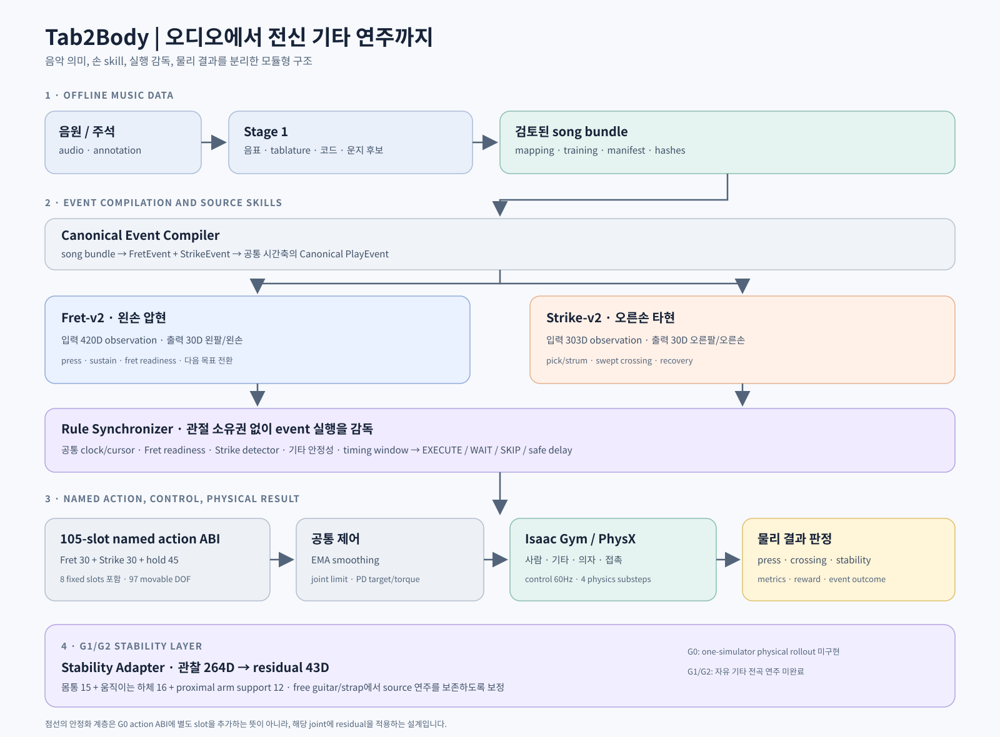

# 기타 프로젝트 온보딩 문서

> **작성 당시 설명 자료 — 2026-09-12.** 아래 구조·차원은 당시 기준이다. 최신 실행과 구현 상태는 [현재 문서 목차](../DOCUMENT_INDEX.md), 자유 기타 학습은 [StabilityAdapter](../../stability_adapter/README.md)를 따른다.

이 문서의 목적은 지금까지 진행된 기타 프로젝트를 처음 접하는 사람이 다음 질문에 답할 수 있게 하는 것입니다.

- 소리가 들어온 뒤 기타 연주 동작까지 어떤 단계로 바뀌는가?
- 각 모듈은 무엇을 입력받고 무엇을 출력하는가?
- 왼손과 오른손을 왜 따로 학습하는가?
- 학습된 두 정책은 어떻게 하나의 몸 전체 동작으로 합쳐지는가?
- 현재 실제로 동작하는 부분과 아직 구현·검증 중인 부분은 무엇인가?

## 먼저 읽을 순서

시간이 짧으면 아래 순서로 읽습니다.

1. [전체 구조](01_전체구조.md)
2. [오디오·데이터·운지 변환](02_오디오_데이터_운지.md)
3. [Fret: 왼손 압현](03_Fret_왼손압현.md)
4. [Strike: 오른손 타현](04_Strike_오른손타현.md)
5. [시뮬레이터·학습·실행](05_시뮬레이터_학습_운영.md)
6. [G0 동기화와 전체 결합](06_G0_동기화_전체결합.md)
7. [자유 기타·스트랩·안정화](07_자유기타_스트랩_안정화.md)

마지막으로 [설명회 진행 체크리스트](08_설명회_진행_체크리스트.md)와 [용어집](90_용어집.md)을 참고합니다.

## 프로젝트를 한 문장으로 말하면

**음원에서 기타 연주 사건을 추출하고, 왼손 압현과 오른손 타현 기술을 각각 물리 시뮬레이터에서 학습한 뒤, 몸·기타·스트랩의 안정성을 고려해 하나의 전신 연주 동작으로 결합하는 프로젝트**입니다.

## 전체 흐름

```text
음원/주석
   │
   ▼
Stage 1: 음원 → 음표·박자·코드·핑거링 후보
   │
   ▼  검토한 song bundle
   ├──────────────────────┐
   ▼                      ▼
Fret-v2                Strike-v2
왼손 압현 정책          오른손 타현 정책
420D obs / 30D action   303D obs / 30D action
   │                      │
   └──────────┬───────────┘
              ▼
G0: Canonical PlayEvent + Rule Synchronizer
              │
              ▼
105-slot 이름 기반 전신 action ABI (97 movable DOF)
              │
              ▼
G1/G2 목표: 자유 기타·스트랩·안정화 residual까지 포함한 전신 연주
```



주요 설명 그림: [전체 architecture](images/system-architecture.svg) · [한 control step](images/runtime-one-step.svg) · [action 소유권](images/action-ownership.svg) · [줄 인덱스 변환](images/string-index-map.svg) · [G0–G2 단계](images/g0-g1-g2-roadmap.svg)

## 현재 계약을 빠르게 보기

| 부분 | 관찰 입력 | 정책 출력 | 현재 의미 |
|---|---:|---:|---|
| Fret-v2 | 420차원 | 30차원 | 왼팔·왼손의 목표 동작 제안 |
| Strike-v2 | 303차원 | 30차원 | 오른팔·오른손의 목표 동작 제안 |
| Stability Adapter | 264차원 | 43차원 residual | 몸·하체·팔 지지 동작을 보정하는 현재 설계 |
| Full action ABI | 모듈 출력과 hold | 105 slots (97 movable DOF) | 전신 관절 슬롯에 이름으로 배치하는 최종 인터페이스 |
| 유효 이동 축 | 105 슬롯 중 8개 zero-range 제외 | 97축 | 실제로 움직일 수 있는 축 수 |

여기서 “action 30차원”은 관절 30개를 직접 물리적으로 움직인다는 뜻입니다. “observation 420차원”은 정책이 현재 상태와 목표를 숫자 벡터로 받는다는 뜻입니다.

## 현재 상태를 읽는 법

현재 저장소에는 계획 문서, 과거 실험 기록, 최신 코드가 함께 있습니다. 따라서 다음 원칙을 지킵니다.

- 차원·필드·배열 순서가 궁금하면 현재 `*_contract.py`, 모델 코드, manifest를 우선 확인합니다.
- Fret과 Strike의 개별 정책·계약·CPU 결합 경계는 구현되어 있습니다.
- 규칙 기반 Canonical event compiler와 Synchronizer, 105-slot action bridge(97 movable axes), CPU integration probe가 구현되어 있습니다.
- 하나의 Isaac Gym에서 Fret·Strike·안정화 정책을 함께 물리 rollout하는 `FullG0Task`는 아직 다음 단계입니다.
- 자유 기타와 스트랩 관련 실험은 진행 중이지만, 자유 기타 상태에서 안정적으로 전곡을 연주하는 G1/G2는 완료되지 않았습니다.
- 일부 상태 문서에는 과거 51차원/304차원 StabilityAdapter 설계가 남아 있습니다. 현재 코드 기준 StabilityAdapter 계약은 43차원 action, 264차원 observation입니다.

## 가장 중요한 구분

### 음악적 의미와 관절 제어는 다릅니다

“몇 번째 줄의 몇 프렛을 누를지”는 음악 데이터의 의미입니다. “팔꿈치와 손가락 관절을 어느 위치로 보낼지”는 제어 문제입니다. 이 둘을 분리해야 운지 변경, 정책 교체, 물리 조건 변경을 독립적으로 다룰 수 있습니다.

### actor가 원한다고 실제 연주가 성공한 것은 아닙니다

정책이 오른손을 움직였다는 사실은 타현 성공이 아닙니다. 실제 pick point가 유한한 줄 구간을 올바른 방향·속도로 통과했는지, 왼손이 준비되었는지, 기타가 안정적인지를 물리 결과로 판정합니다.

### G0, G1, G2는 난이도와 책임 범위가 다릅니다

- **G0**: 기타를 고정하고 기존 Fret·Strike 기술과 동기화·결합 계약을 검증합니다.
- **G1**: 기타를 자유롭게 하고 스트랩과 안정화 정책을 추가합니다. 기존 Fret·Strike는 frozen source로 보존하는 방향입니다.
- **G2**: 인공적인 도움을 줄이고 짧은 구절에서 전곡으로 확장합니다.

## 코드로 내려가고 싶을 때

- Stage 1: `../../tab2fingermapping/README.md`
- song bundle: `../../data/song_bundles/README.md`
- Fret 코드: `../../tab2body/fret_v2_contract.py`, `../../tab2body/learning/fret_v2_model.py`
- Strike 코드: `../../tab2body/strike_v2_contract.py`, `../../tab2body/learning/strike_v2_model.py`
- 공통 물리 환경: `../../tab2body/env/base.py`
- 전체 결합: `../../tab2body/full/README.md`
- 상위 설계: `../../master_plan/README.md`
