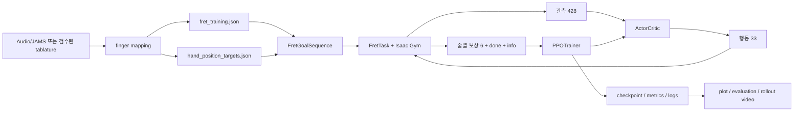

# Fret 학습 코드 구조와 실행 계약

최종 점검일: 2026-08-18  
대상: `tab2body`의 고정 기타 왼손 fret 학습(S0)  
기본 곡: `02_Jazz1-200-B_solo`

이 문서는 fret 학습의 현재 코드가 무엇을 입력받고, 무엇을 출력하며,
어떤 순서로 실행되는지를 설명한다. 코드와 문서가 다르면 다음 파일을
우선한다.

1. 실행 설정: `tab2body/cfg.py`의 `FRET`
2. 환경 계약: `tab2body/env/tasks/task_fret.py::FretTask`
3. 목표 계약: `tab2body/env/goals.py::FretGoalSequence`
4. 보상 계약: `tab2body/env/rewards/fret.py::FretReward`
5. 학습 계약: `tab2body/learning/ppo.py::PPOTrainer`
6. 단계 전환: `tab2body/learning/curriculum.py::FingertipApproachCurriculum`

## 1. 범위

직접 실행 경로와 이를 지원하는 입력 생성, 평가, 그래프, 영상, 안전 진단,
회귀 테스트를 포함한다. 오디오 전사와 코드 추정 모델 전체는 별도 연구
영역이다. 다만 fret 입력 생성기가 직접 호출하는 finger mapping 경계는
이 문서에 포함한다.

현재 환경의 핵심 특성은 다음과 같다.

- 한 정책이 한 곡을 여러 PPO iteration 동안 반복 최적화한다.
- 기타, 사람의 루트, 의자 배치는 고정된 G0 환경이다.
- 제어 주파수는 60 Hz, PhysX substep은 4회다.
- 병렬 환경 기본값은 1024개다.
- 정책 행동은 왼쪽 흉곽부터 손가락까지 33차원이다.
- 관측은 428차원이다.
- 보상과 value head는 기타 줄별 6차원이다.
- 바레 표현은 데이터 구조에 흔적을 남겼지만 현재 S0에서는 금지한다.
- 문자열의 실제 진동과 음향은 시뮬레이션하지 않는다. 압현은 강체 위치와
  분석적 접촉 깊이로 판정한다.

## 2. 전체 데이터 흐름



중요한 경계는 다음과 같다.

- 학습기는 오디오를 직접 읽지 않는다.
- 학습기의 직접 입력은 60 Hz 목표 JSON과 선택적 손목 목표 JSON이다.
- 오디오는 영상에 소리를 합칠 때만 다시 사용한다.
- 커리큘럼은 새로운 임의 운지를 만들지 않는다. 현재 곡에서 실제로 나온
  프레임, 코드, 전환만 다시 표본화한다.

## 3. 입력 데이터 계약

### 3.1 곡 번들

`tab2body/song_bundles.py`가 표준 경로를 만든다.

```text
data/song_bundles/<song_id>/
├── source/audio.wav
├── mapping/fingering.json
└── training/
    ├── fret_training.json
    └── hand_position_targets.json
```

`--song <song_id>`를 쓰면 `training/fret_training.json`을 선택한다.
`--goal`을 쓰면 번들 밖의 사용자 지정 목표도 받을 수 있다. 둘은 동시에
쓸 수 없다.

### 3.2 `fret_training.json`

스키마는 `tab2body.fret_training.v1`, 시간축은 정확히 60 Hz다. 각 프레임의
핵심 필드는 다음과 같다.

| 필드 | 크기 | 의미 |
|---|---:|---|
| `fret_goal` | 6 | 줄별 PRESS/NO_PRESS/DONT_CARE |
| `finger_goal` | 6 | 0=없음, 1=검지, 2=중지, 3=약지, 4=소지 |
| `barre_goal` | 6 | 확장용 바레 표식. 현재는 모두 false여야 함 |
| `hand_anchor_fret` | 1 | 손 전체의 기준 프렛 |
| `hand_allowed_fret_range` | 2 | 손목·손 위치가 머물 넓은 프렛 범위 |
| `frame`, `t` | 각 1 | 증가하는 프레임 번호와 시간 |

줄 순서는 저장된 Isaac 순서인 `0=high-e`, `5=low-E`다.

`fret_goal`의 값은 다음처럼 해석한다.

- `fret > 0`: 해당 프렛은 PRESS다. 더 높은 번호의 프렛은 NO_PRESS이고,
  더 낮은 프렛은 DONT_CARE다. 높은 프렛을 누르면 낮은 프렛의 효과가
  사라지는 기타의 우선순위를 반영한다.
- `fret == -1`: 그 줄의 모든 프렛이 NO_PRESS다.
- `fret == 0`: 음향 판정은 DONT_CARE다. 관통·과도한 힘 같은 안전 규칙은
  그대로 적용한다.

### 3.3 손가락별 13차원 이벤트

`build_finger_next_goal_vectors()`가 각 프레임과 네 손가락에 대해 만든다.

```text
[next_string_mask(6),
 next_fret(1),
 time_to_next_goal(1),
 next_valid(1),
 time_to_current_change(1),
 relation_KEEP(1), relation_MOVE(1), relation_REST(1)]
```

총 13차원이며 시간은 최대 2초 범위로 정규화한다. 바레가 활성화되는
미래 확장에서는 `next_string_mask`가 여러 줄을 표현할 수 있다. 현재 S0는
한 손가락이 동시에 여러 줄을 맡는 입력을 거부한다.

### 3.4 `hand_position_targets.json`

곡에서 추정한 hand anchor를 실제 기타 asset의 프렛 위치로 변환한 손목
soft target이다.

- 입력 단위: 기타 로컬 좌표의 metre
- 각 표본: `wrist_pos_guitar[3]`, `allowed_radius_m`, anchor/range
- 표본 사이: 60 Hz goal 프레임에 맞춰 보간
- 용도: 손가락만으로 해결할 수 없는 큰 위치 이동을 안내
- 성격: hard target이 아니라 허용 반경을 둔 soft reward

## 4. 런타임 텐서 계약

`N`은 병렬 환경 수다. 기본값은 1024다.

### 4.1 관측 `obs: [N, 428]`

| 구간 | 차원 | 내용 |
|---|---:|---|
| 기본 신체 상태 | 180 | 비고정 관절 위치·속도와 기타 로컬 신체점 6개 |
| 기본 goal | 128 | 0/6/15프레임 lookahead 75 + 손가락 이벤트 52 + 곡 phase 1 |
| 이전 행동 | 33 | EMA actuator 상태를 포함해 단일 프레임 관측을 Markov에 가깝게 유지 |
| 엄지 상태 | 12 | 엄지 두 점의 기타 로컬 좌표 6 + 후면 기하/접촉 6 |
| 장기 미래 문맥 | 75 | 30/60/90프레임 lookahead, 각 25차원 |

각 25차원 goal chunk는 다음과 같다.

```text
fret 6 + finger 6 + barre 6 + anchor 1 + allowed range 2
+ wrist xyz 3 + relative time 1 = 25
```

과거 341차원 체크포인트는 장기 미래 문맥 75차원이 없던 계약이다.
`--initialize-from`은 이 prefix 호환 모델의 입력층과 running statistics를
확장할 수 있다. 일반 `--checkpoint` resume은 정확한 계약 일치를 요구한다.

### 4.2 행동 `action: [N, 33]`

정책은 tanh-squashed diagonal Gaussian에서 `[-1, 1]` 행동을 만든다.
행동은 관절 hard range의 PD target으로 선형 변환되고 EMA로 완화된다.

| 그룹 | 차원 | 관절 |
|---|---:|---|
| 왼쪽 흉곽 | 3 | `L_Thorax_xyz` |
| 어깨·팔꿈치·손목 | 9 | 각 xyz |
| 엄지 | 5 | thumb1 xyz, thumb2, thumb3 |
| 검지·중지·약지·소지 | 16 | 각 MCP flex/lateral, PIP, DIP |

하체와 그 밖의 관절은 정책 행동에 포함하지 않는다. 하체는 hard-limit
pinning, armature, 매 step pose 재주입으로 고정 자세를 유지한다.

### 4.3 보상과 종료

```text
reward: [N, 6]     # 줄별 reward/value channel
done:   [N]        # episode 종료 여부
info:   dict[str, Tensor]
```

critic은 6개 줄의 value를 각각 예측한다. actor advantage는 곡 전체에서
한 번이라도 감독되는 줄만 남긴 뒤 가중합하고, 그 scalar를 한 번 정규화한다.
따라서 DONT_CARE뿐인 줄이 정책 gradient를 차지하지 않는다.

PPO rollout 기본 크기는 다음과 같다.

```text
horizon 32 × env 1024 = iteration당 32,768 transition
minibatch 4,096 × 8개, PPO epoch 5회
```

여기서 터미널에 표시하는 `epoch`은 곡 전체 재생 횟수가 아니라 PPO
iteration이다. `--iterations 10000`은 resume 시에도 현재 iteration에서
10,000회를 추가한다.

## 5. 한 control frame의 실행 순서

`FretTask.step(actions)`의 실제 순서는 다음과 같다.

1. 현재 curriculum에 따른 action mask를 구한다.
2. 제한된 관절 행동은 이전 행동으로 유지한다.
3. 비활성 인접 손가락에 작은 굽힘 synergy를 적용한다.
4. 행동을 EMA 처리한 뒤 PD target으로 바꾼다.
5. PhysX를 1/60초 진행하고 상태·접촉 tensor를 갱신한다.
6. 현재 goal과 준비시간을 반영한 손가락 이벤트를 읽는다.
7. `FretReward.compute()`가 줄별 보상과 세부 metrics를 만든다.
8. 성공 pose/action cache에서 policy teacher target을 만든다.
9. 손가락 후면 한계의 soft cost를 적용한다.
10. sustain, confusion matrix, curriculum 통계를 누적한다.
11. 준비시간이 끝난 환경만 goal clock을 전진시킨다.
12. 관통, 손가락 겹침, 접촉 하중, 손목, 손바닥, 엄지 안전을 계산한다.
13. 관통 soft cost를 빼고, 유효 관통 프레임의 양의 보상을 0으로 제한한다.
14. 다음 관측을 만든다.
15. 정상 완주와 실패 종료를 구분한다.
16. 실패에는 줄 전체 `-25`를 부여한다.
17. 종료 환경을 reset하고, PPO에는 terminal observation과 새 reset
    observation을 구분해 반환한다.

준비시간 기본값은 60프레임(1초)이다. 이 동안 goal clock은 멈추지만
goal 관측과 reward는 활성 상태이므로 첫 목표로 접근할 수 있다. 다만
episode/curriculum 성능 통계에는 준비 프레임을 넣지 않는다.

## 6. 모듈별 분석

### 6.1 진입점·설정·경로

| 모듈 | 입력 | 출력 | 책임과 주요 API |
|---|---|---|---|
| `tab2body/train.py` | CLI 전체 | fret/strike runner 호출 | `resolve_task()`, `runner_argv()`, `load_runner()`로 태스크를 먼저 고르고 무거운 환경 import를 늦춘다. |
| `tab2body/train_fret.py` | CLI, `FRET`, goal, checkpoint | 학습/평가, run 산출물 | 환경·모델·PPO·커리큘럼 조립, 초기화/재개, checkpoint 계약, deterministic 평가, plot/video 후처리의 orchestration을 맡는다. |
| `tab2body/cfg.py` | 없음 | `FRET` dict | 현재 실험의 단일 기본 설정. 물리, 보상, 안전, curriculum, PPO, 저장 간격을 모은다. |
| `tab2body/song_bundles.py` | `song_id` 또는 training path | 표준 audio/goal/hand-target 경로 | path traversal을 막고 번들 ID를 결정한다. |
| `tab2body/env/config.py` | 생성자 type, config dict, override | 검증된 kwargs | 생성자 signature에 실제 존재하는 설정만 전달한다. 누락 필수값과 잘못된 override를 즉시 거부한다. |
| `tab2body/env/tasks/__init__.py` | `FretTask`/`StrikeTask` 이름 | 요청한 class | 태스크를 지연 import해 왼손과 오른손 의존성을 분리한다. |
| `tab2body/learning/__init__.py` | 공개 학습 class 이름 | 요청한 class/function | 모델, PPO, fret/strike curriculum을 지연 import한다. fret 실행이 strike 학습 모듈을 불필요하게 로드하지 않는다. |
| `tab2body/env/rewards/__init__.py` | 보상 class 이름 | 요청한 class | fret/strike 보상을 지연 import한다. |

`train_fret.py`의 주요 함수는 다음과 같다.

- `_load_fret_runtime()`: Isaac Gym을 torch보다 먼저 import하고 런타임 심볼을
  연결한다.
- `build_parser()`: 학습, 평가, resume, migration, artifact 옵션을 정의한다.
- `goal_identity()`, `resolve_hand_targets()`, `resolve_out_dir()`: 입력과 run
  identity를 결정한다.
- `protect_new_run_output()`: 새 학습이 기존 run을 덮지 못하게 한다.
- `training_resource_preflight()`: GPU VRAM, RAM, disk, 환경 수를 검사한다.
- `build_runtime_checkpoint_contract()`: 데이터·설정·코드·asset hash를 봉인한다.
- `evaluate()`: deterministic 전곡 episode를 집계하고 평가 gate를 계산한다.
- `main()`: 전체 생명주기를 실행한다.

### 6.2 물리 기반 환경

| 모듈 | 입력 | 출력 | 책임과 주요 API |
|---|---|---|---|
| `tab2body/env/base.py` | 환경 수, 제어 prefix, asset, 행동 | PhysX 상태와 기본 관측 | `GuitarEnvBase`가 sim/actor/tensor를 만들고 reset, PD action, finite guard, physics step, 기타 로컬 좌표 변환을 제공한다. |
| `tab2body/env/collision.py` | 없음 | collision 상수 | humanoid/guitar filter, 전용 엄지 pad와 support proxy 이름, contact offset을 정의한다. |
| `tab2body/env/goals.py` | goal JSON, hand target JSON, stage | 현재 goal dict와 policy goal observation | 입력 검증, sustain raster, 13D 다음 목표, curriculum별 표본 추출, random start, time advance를 담당한다. |
| `tab2body/env/metrics.py` | frame별 press/이동 상태 | episode sustain·drag metrics | `PressSustainTracker`와 진단 전용 `PressedDragMonitor`를 유지한다. |
| `tab2body/env/safety.py` | rigid body 위치·접촉·torque | soft cost, 진단, termination mask | 손목 box, 손가락 후면 plane, 손가락 capsule 겹침, 접촉 하중, 현재/스윕 관통을 분석한다. |
| `tab2body/env/tasks/task_fret.py` | goal 경로, FRET kwargs, action | `(obs, reward, done, info)` | 모든 하위 모듈을 실제 RL 환경으로 통합한다. reset 일관성, success RSI/action cache, curriculum 상태 저장, 종료와 metrics를 관리한다. |

`GuitarEnvBase`의 핵심 입출력은 다음과 같다.

- `reset() -> obs`: 모든 환경을 초기 pose로 두고 한 번 물리를 진행해 body
  위치까지 일관된 관측을 만든다.
- `reset_idx(env_ids)`: 일부 환경의 DOF/root/EMA/finite latch를 되돌린다.
- `apply_actions([N,33])`: NaN/Inf를 이전 유효 행동으로 대체하고 EMA와
  hard limit을 적용한다.
- `termination_reasons() -> dict[str,[N]]`: timeout, nonfinite, velocity
  blowup을 분리한다.
- `to_guitar_frame([N,K,3]) -> [N,K,3]`: 고정/이동 기타 모두 같은 관측
  좌표 계약을 쓰게 한다.
- `compute_observations() -> [N,180]`: 비고정 DOF 상태와 기타 상대 body
  위치를 반환한다.

`FretGoalSequence`의 핵심 입출력은 다음과 같다.

- 생성자: JSON을 GPU tensor로 옮기고, 곡에서 손가락별 단일 압현,
  지속 코드, 문맥 상태, goal pair, transition catalog를 만든다.
- `reset(env_ids)`: 현재 단계에 맞춰 곡의 시작 프레임 또는 연습 표본을 뽑는다.
- `current() -> dict`: 현재 `fret/finger/barre`, 손목, sustain, 13D event를
  반환한다.
- `observe() -> [N,128]`: 정책용 근미래 goal을 반환한다.
- `observe_future_context() -> [N,75]`: 0.5/1.0/1.5초 미래 문맥을 반환한다.
- `advance(mask)`: 준비가 끝난 환경의 곡/연습 시간을 한 frame 전진시킨다.
- `done -> [N]`: 곡 끝 또는 연습 window 끝을 표시한다.

`FretTask`의 추가 책임은 다음과 같다.

- 제어 DOF가 정확히 33개인지 확인한다.
- 보상 설정은 `reward_config` 하나로 `FretReward`에 전달한다. 태스크 생성자가
  같은 보상 인자와 기본값을 다시 선언하지 않는다.
- 초기 pose와 각 관절 범위에서 초기 actor mean을 계산한다.
- 비활성 손가락 synergy를 실제 PD target에 최대 2도 범위로 더한다.
- 현재 config에서 `goal_pair_action_routing=False`다. 관련 코드는 확장용으로
  남아 있지만 일반 goal-pair 행동을 제한하지 않는다.
- 성공한 곡 pose를 slot별 cache에 저장하고 late curriculum의 RSI와 약한
  action teacher에 재사용한다.
- `curriculum_state_dict()`와 `load_curriculum_state_dict()`로 sampler와
  success cache를 checkpoint에 포함한다.

### 6.3 압현·자연스러움 보상

| 모듈 | 입력 | 출력 | 책임과 주요 API |
|---|---|---|---|
| `tab2body/env/rewards/common.py` | tensor | `[0,1]` tensor | `smoothstep01()` 수치 유틸리티다. |
| `tab2body/env/rewards/fret.py` | 현재 goal과 환경 상태 | 줄별 reward `[N,6]`, metrics dict | 압현 기하, 거리, 깊이, 위치, 유지, PRESS/NO_PRESS, 오압현, 다음 목표, hover, coupling, slip을 통합한다. |
| `tab2body/env/rewards/thumb.py` | 엄지 distal 위치와 contact force | 엄지 reward와 기하/접촉 metrics | 테이퍼 넥 후면까지 거리·gap·footprint·압축을 계산하고 접촉 hysteresis와 과힘 품질을 만든다. |
| `tab2body/env/rewards/motion.py` | 관절 속도와 손끝 거리 | proximal reward와 그룹별 motion | 목표 근처에서 손가락→손목→팔꿈치→어깨 순으로 움직임 비용을 높인다. |
| `tab2body/env/rewards/reference_posture.py` | 현재 손 관절과 reference JSON | 손가락/엄지 자세 품질 | 사람 motion exemplars 중 가장 가까운 자세를 약한 prior로 사용한다. 활성 압현 손가락은 prior에서 제외한다. |

#### 압현 기하

`FretReward`는 손가락 네 마디 사이를 표본화하고, 각 줄을 원통형 pad로
근사한다.

- 프렛별 cell 안에 있는 표본만 후보로 쓴다.
- 일반 압현은 distal fingertip 표본만 성공으로 인정한다.
- 접촉 on 깊이: 1.0 mm
- 접촉 off 깊이: 0.5 mm
- hysteresis로 solver 경계의 깜빡임을 줄인다.
- 목표 압점은 cell의 20% 지점이다.
- 엄격한 좋은 위치 범위는 5%~35%다.
- 같은 프렛의 여러 손가락은 최소 손끝 간격을 확보하도록 cell 안 목표를
  stagger한다.

#### 기본 PRESS 점수

압현 core의 기본 구조는 코드상 다음과 같다.

```text
30%  목표 거리
40%  깊이/접촉 획득
15%  연속 hold
20%  성공한 압현의 좋은 위치
```

실제 수식에서는 깊이/성공을 `press_acquisition = 0.4*depth + 0.6*success`로
먼저 합치므로 위 항은 최종 reward 안에서 중첩된다. 또한 위치 precision
gate, 손가락 아치, 엄지, 단계별 보정이 적용된다. 따라서 30/50/20은 연구
의도이고, 최종 수치가 항상 세 항의 단순 합은 아니다.

기본 late-stage auxiliary weight는 현재 설정에서 다음과 같다.

```text
task core 0.61
wrist     0.15
thumb     0.20
hover     0.02
slip      0.02
smooth    0.00
```

그 뒤 proximal hierarchy, thumb press factor, 오압현/near-miss/dropout,
class balance, 다음 목표, success-pose guide, reference prior가 조건부로
적용된다.

#### PRESS/NO_PRESS 균형

- 일반 class weight: PRESS 0.70, NO_PRESS 0.30
- late chord 단계는 PRESS 중 가장 낮은 손가락 품질을 함께 본다.
- static/bridge 단계에서 PRESS가 실패하면 쉬운 NO_PRESS만으로 높은 점수를
  얻지 못하게 NO_PRESS credit을 제한한다.
- 실제 오압현은 해당 줄 core를 0으로 만든 뒤 0.35를 추가 감점한다.
- 15 mm 안의 near miss는 성공하지 못하면 0.20을 감점한다.
- 획득한 압현의 dropout은 0.25를 감점한다.
- 일반 reward는 단계에 따라 약 `[-0.8, 1]` 또는 `[-1,1]`로 제한한다.
- hard failure termination은 이 범위와 별개로 모든 줄에 `-25`를 준다.

#### 해제와 인접 손가락

- 비활성 손가락은 줄에서 12 mm까지 자유롭게 뜰 수 있다.
- 그보다 멀어지면 위치 reward가 부드럽게 감소한다.
- release 직후 PIP 25도, DIP 10도 부근의 완만한 자세를 선호한다.
- 임박한 MOVE에는 hover 속도 억제를 풀어 다음 목표 접근을 방해하지 않는다.
- 인접 손가락 reward coupling은 현재 압현 손가락의 성공을 보호할 때만 켠다.
- 실제 action synergy는 PRESS나 다음 MOVE가 아닌 follower에만 최대 2도의
  작은 굽힘을 전달한다.

#### 엄지

엄지 마지막 구간의 7개 표본을 기타 로컬 넥 후면에 투영한다.

- 접근 거리, 후면 footprint, signed gap을 연속 신호로 제공한다.
- 전용 thumb pad의 contact force에는 on/off hysteresis를 둔다.
- raw net force는 pair-specific force가 아니므로 정밀 압력 목표가 아니라
  폭주 감지에만 가깝게 쓴다.
- 압현 손가락이 25 mm 안으로 오면 엄지 지지 gate가 완전히 활성화되고,
  80 mm 밖에서는 비활성화된다.
- 늦은 curriculum 승급에는 contact 자체가 아니라
  `thumb_press_readiness >= 0.35` 기하 gate가 적용된다.
- 실제 contact-rate gate는 현재 비활성이다.

### 6.4 안전과 종료

| 조건 | 처리 | 구현 위치 |
|---|---|---|
| NaN/Inf action·state·obs·reward | 즉시 실패 종료, finite 값으로 sanitize | `base.py`, `task_fret.py` |
| 관절 속도 50 rad/s 초과 | 즉시 실패 종료 | `base.py` |
| 손바닥 inward normal의 world-z가 -0.3 미만 3프레임 | 실패 종료 | `task_fret.py`, `safety.py` |
| 손목이 넓은 기타 로컬 box 밖 3프레임 | 실패 종료 | `WristSafetyBoxMonitor` |
| 비엄지 손가락이 넥 후면 plane을 넘음 | soft 감점, 심하면 3프레임 후 종료 | `FingerBackLimitMonitor` |
| 기타 solid 2.5 mm 이상 침투 | soft 감점 | `GuitarPenetrationMonitor` + task |
| 5 mm 이상 3프레임 또는 한 step tunneling | 실패 종료 | 같은 모듈 |
| 엄지 과도한 force/압축 3프레임 | 실패 종료 | `ThumbSupportReward`, task |
| 손가락끼리 capsule 겹침 | 현재 진단만 | `FingerSelfIntersectionMonitor` |
| 지지 부위/비활성 손가락 contact load | 현재 진단만 | `ContactLoadMonitor` |

엄지는 넥 뒤에 있어야 하므로 일반 guitar penetration chain에서 제외하고,
전용 후면 위치·압축·과힘 규칙으로 처리한다.

현재 관통 검사는 정확한 삼각형 mesh signed distance가 아니다. 넥, body,
pluck surface를 닫힌 분석 형상으로 근사하고, 각 신체 chain의 공간 표본과
이전→현재 사이 시간 표본을 검사한다. 얇은 표면을 한 step에 통과하는
tunneling은 swept sample로 보완한다.

### 6.5 정책과 PPO

| 모듈 | 입력 | 출력 | 책임과 주요 API |
|---|---|---|---|
| `tab2body/learning/models.py` | obs, 선택적 action mask | action, log-prob, value | `RunningMeanStd`, 512/256 MLP actor·critic, tanh Gaussian, 손가락 초기 굽힘과 엄지 exploration seed를 제공한다. |
| `tab2body/learning/ppo.py` | vector env, model, `PPOConfig` | 갱신된 model, checkpoint, JSONL/log | rollout 수집, GAE, 줄별 advantage 결합, clipped PPO, KL early stop, teacher/saturation loss, episode aggregation을 수행한다. |
| `tab2body/learning/curriculum.py` | iteration 통계와 환경 catalog | 다음 stage 설정과 sampler 상태 | 성능·증거량·회귀를 기준으로 13단계를 전환한다. goal-pair 내부 retention/mixed/full/recovery도 관리한다. |
| `tab2body/learning/checkpoint_contract.py` | 데이터/config/code/asset/model 계약 | 봉인된 hash 문서, 호환성 검증 | canonical JSON SHA-256, 파일 지문, field-level diff, fail-closed resume/eval을 제공한다. |
| `tab2body/learning/evaluation.py` | 전곡 episode metrics | gate별 pass/fail dict | F1, NO_PRESS, wrong press, sustain, 완주, 안전, 선택적 엄지 gate를 독립적으로 판정한다. |
| `tab2body/learning/run_layout.py` | workspace, song, run name/checkpoint | `RunLayout` | `YYYYMMDD_HHMM_노래` run 경로와 checkpoint/eval/video/plot 기본 위치를 만든다. |
| `tab2body/learning/run_io.py` | manifest/session/artifact/resource 정보 | atomic JSON, JSONL, resource snapshot | fret/strike 공용 run 기록, artifact 오류 분리, GPU/RAM/disk 사전 검사를 수행한다. |

#### ActorCritic

- actor와 critic은 별도 MLP지만 같은 observation normalization을 쓴다.
- actor output은 latent mean이고 `tanh` 후 실제 행동이 된다.
- 초기 mean은 seated pose의 정확한 inverse PD action이다.
- critic output은 6개 줄별 value다.
- actor learning rate는 `5e-6`, critic은 `3e-4`다.
- KL이 0.03을 넘으면 다음 optimizer mutation 전에 update를 중단한다.
- `log_std`는 학습하되 단계별로 엄지/손가락 탐색 floor·ceiling을 조정한다.

`policy_action_mask`는 두 역할이 다르다.

- isolated press의 physical mask: 허용하지 않은 관절을 이전 행동으로
  유지한다.
- goal-pair routing mask: PPO log-prob/entropy의 gradient 범위를 제한한다.
  physical finger는 hover/release/예비 자세를 위해 계속 움직일 수 있다.

현재 config는 goal-pair routing 자체를 꺼 두었다.

#### PPOTrainer

- `collect()`는 reusable `obs_buf`가 step에서 덮이기 전에 policy observation을
  clone한다.
- terminal episode metric과 frame diagnostic을 별도 gate로 집계한다.
- rollout 전체에 대해 한 번 finite 검사를 수행한다.
- `advantages()`는 줄별 GAE를 만든 뒤 actor weight로 scalar화한다.
- `update()`는 PPO clip, clipped value loss, entropy, thumb saturation,
  선택적 action teacher loss를 계산한다.
- observation running statistics는 PPO update 뒤 갱신해 old/new log-prob가
  같은 normalization을 쓰게 한다.
- `save()`는 임시 파일 후 rename으로 checkpoint를 원자적으로 저장한다.
- `resume()`은 model tensor를 만지기 전에 checkpoint 계약을 검증한다.
- `resume_migrated()`는 사용자가 명시했을 때만 같은 tensor layout의 상태를
  새 계약으로 옮긴다.

### 6.6 Curriculum

현재 순서는 다음과 같다.

```mermaid
flowchart LR
    A["coarse_reach"] --> B["fine_reach"]
    B --> C["isolated_press"]
    C --> D["integrated_press"]
    D --> E["chord_reach"]
    E --> F["chord_fine_reach"]
    F --> G["static_chord"]
    G --> H["frozen_context"]
    H --> I["goal_pair"]
    I --> J["transition_window"]
    J --> K["coverage"]
    K --> L["integration"]
    L --> M["full_song"]
```



| 단계 | 표본과 학습 목표 | 대표 승급 조건 |
|---|---|---|
| `coarse_reach` | 곡에 있는 단일 손가락 목표까지 넓게 접근 | p90 거리 40 mm 이하, 성공 window |
| `fine_reach` | 같은 목표의 xyz 정밀 정렬 | p90 10 mm 이하, alignment 0.90 이상 |
| `isolated_press` | 목표 손가락+엄지, 손목 위주로 실제 압현 | 위치 품질 0.50, 아치 0.65, 성공 window |
| `integrated_press` | 팔 움직임을 허용해 압현 통합 | 위치 품질 0.50, 엄지 gate, 성공 window |
| `chord_reach` | 곡의 지속 다중 손가락 코드에 동시 접근 | 전체/손가락별 성공과 40 mm 기준 |
| `chord_fine_reach` | 코드 손가락을 하나씩 집중하되 다른 코드도 20% 복습 | 코드별 최소 256 episode, success 0.80, p90 10 mm, alignment 0.80 |
| `static_chord` | 실제 곡의 충분히 지속된 코드 압현·hold·NO_PRESS | 곡 성능 + chord ready/hold 0.90, dropout 0.05 이하 |
| `frozen_context` | 한 프레임을 고정하되 실제 곡 문맥 관측을 점진적으로 혼합 | 최종 문맥, per-finger/F1/NO_PRESS/sustain bridge windows |
| `goal_pair` | 이전 목표 유지, 다음 손가락 이동, 짧은 sequence와 일부 전곡 | retention→mixed 3수준→full, 전환/보존/전곡/손가락별 evidence |
| `transition_window` | 1.0→3.0초 window, 최대 변화 4→12개 | 최종 난이도와 bridge windows |
| `coverage` | 곡의 여러 random start를 폭넓게 복습 | 1000 iteration + bridge gate |
| `integration` | random start를 줄여 긴 구간을 통합 | 1000 iteration + bridge gate |
| `full_song` | 처음부터 끝까지 곡 전체 수행 | 최종 단계, 자동 종료하지 않고 계속 개선 가능 |

일반 초기 단계는 최소 iteration 뒤 최근 3개 성공 window가 모두 0.80을
넘어야 승급한다. late bridge 단계는 episode 수가 충분한 window를 누적하고
F1, 손가락별 press, NO_PRESS, wrong press, sustain, dropout, failure를 함께
본다. soft timeout은 완화 gate를 만족할 때만 강제 승급한다. 단순히 시간이
지났다고 무조건 넘어가지는 않는다.

goal-pair는 망각을 막기 위해 다음을 추가로 한다.

- `retention`: 이전에 배운 정적 상태를 중심으로 복습한다.
- `mixed`: 실제 전환 비율을 10%→20%→35%로 높인다.
- `full`: 짧은 sequence와 20% 전곡 표본을 함께 사용한다.
- 손가락별 mastery를 기록하고 약한 손가락만 25% 정도 집중한다.
- 회귀가 두 window 지속되면 recovery로 들어가되 다른 손가락과 전곡
  표본을 계속 섞는다.
- 성공 pose가 없는 상태도 일정 비율 뽑아 cache에만 의존하는 것을 막는다.

### 6.7 Checkpoint와 run 산출물

기본 run 구조는 다음과 같다.

```text
fret/training/runs/YYYYMMDD_HHMM_<song>/
├── run_manifest.json
├── checkpoints/fret_XXXXXX.pt
├── logs/
│   ├── metrics.jsonl
│   ├── training.log
│   ├── artifacts.log
│   └── sessions.jsonl
├── evaluations/
├── plots/
│   ├── training_curves.png
│   └── fingertip_curriculum.png
└── videos/
    ├── fret_XXXXXX_rollout.mp4
    └── fret_XXXXXX_rollout.stability.json
```

- checkpoint는 500 iteration마다 저장하고 종료 시 마지막 상태도 저장한다.
- 영상 checkpoint는 1000 iteration마다 queue한다.
- 학습 simulator를 닫은 뒤 queue된 영상과 최종 영상을 순차 렌더한다.
- MP4 encoding 성공 뒤 source PNG frame은 삭제한다.
- artifact 실패는 `artifacts`에 문자열로 섞지 않고
  `run_manifest.json::artifact_errors`와 session audit row에 기록한다.
- manifest JSON은 임시 파일+fsync+rename으로 갱신한다.
- metrics와 sessions는 append-only JSONL이다.

Checkpoint에는 다음이 들어간다.

- iteration과 global sample count
- model과 optimizer state
- curriculum/training context
- goal sampler와 success RSI/action cache
- 봉인된 checkpoint contract

계약은 관측·행동·value 크기뿐 아니라 제어 관절 이름, action mapping,
reward/safety/curriculum/PPO 설정, goal/hand target hash, asset hash, 실제 실행
코드 hash까지 포함한다.

### 6.8 평가·그래프·영상 도구

| 모듈 | 입력 | 출력 | 작업 |
|---|---|---|---|
| `tab2body/tools/plot_fret_training.py` | `metrics.jsonl` | `training_curves.png` | reward, value loss, KL, episode F1을 그린다. |
| `tab2body/tools/plot_fingertip_curriculum.py` | `metrics.jsonl` | `fingertip_curriculum.png` | 거리, 정렬, 압현, hold, chord, 엄지와 단계 전환을 그린다. |
| `tab2body/tools/training_metrics.py` | 대형 JSONL과 필요한 key | 선택 열의 row list | plot이 전체 metric 객체를 불필요하게 유지하지 않게 한다. |
| `tab2body/tools/record_fret_rollout.py` | checkpoint, goal, hand target, 선택 audio | MP4와 stability JSON | 한 환경에서 deterministic 전곡 rollout을 close-up/upper-body로 기록한다. |
| `tab2body/tools/fretboard_visualization.py` | 실제 sim geometry와 camera | 이미지 overlay | 실제 fret/string, 압현 범위, 손목 box, 손가락 후면 plane, 손바닥 vector를 투영한다. 물리에는 영향을 주지 않는다. |
| `tab2body/tools/render_fretboard_reference.py` | goal, camera 옵션 | fret 기준 PNG | 프렛, 줄, 20% 목표와 품질 대역을 정적 장면에 표시한다. |
| `tab2body/tools/render_wrist_safety_multiview.py` | 환경과 view 설정 | 6방향 PNG | 기타 로컬 손목 safety box를 보여준다. |
| `tab2body/tools/render_finger_back_limit_plane.py` | 환경과 view 설정 | 4방향 PNG | 비엄지 손가락의 후면 종료 plane을 보여준다. |
| `tab2body/tools/render_palm_world_direction.py` | 환경과 view 설정 | 4방향 PNG | 손바닥 inward vector와 world up/down 관계를 보여준다. |

`train_fret.py::evaluate()`는 영상과 별도로 deterministic 전곡 평가를 한다.
평가 결과는 F1, NO_PRESS accuracy, wrong press, sustain, per-finger 성공,
엄지, motion, hover, slip, 안전 종료를 포함한다. 최종 `passed`는 활성 gate의
논리곱이다. 손가락 capsule 겹침과 일부 자연스러움 항목은 아직 진단 전용이다.

### 6.9 입력 생성과 finger mapping 경계

| 모듈 | 입력 | 출력 | 작업 |
|---|---|---|---|
| `tab2body/tools/build_fret_training_data.py` | GuitarSet JAMS 또는 검수 `fingering.json`, audio 경로 | `fret_training.json`, `hand_position_targets.json` | 60 Hz raster, release NO_PRESS window, hand anchor, 입력 계약을 만든다. |
| `tab2fingermapping/fingermapping/run_fingering.py` | notes CSV + chord JSON | `fingering.json` | note별 finger/barre/grip과 press event, hand timeline, 진단을 묶는다. |
| `tab2fingermapping/fingermapping/assign.py` | note와 chord segment | finger assignment와 press event | grip/멜로디/바레 후보, beam search, shift·lift·stretch 비용, sustain 충돌을 처리한다. |
| `tab2fingermapping/fingermapping/grips.py` | root/quality, note footprint | 관용 grip 후보와 일치도 | open/CAGED/power chord 사전을 제공한다. |
| `tab2fingermapping/fingermapping/render_timeline.py` | `fingering.json` | timeline PNG | 사람이 운지와 press/release 시점을 검수할 이미지를 만든다. |

`build_fret_training_data.py`의 release 처리 원칙은 다음과 같다.

- 같은 위치 재타현은 upstream `press_events()`가 하나의 PRESS로 병합한다.
- 현재 event의 `t_release`부터 같은 줄 다음 press의 `t_press` 전까지는
  NO_PRESS다.
- 마지막 event 뒤에는 미래 이동 요구가 없으므로 DONT_CARE로 돌아간다.
- 활성 PRESS는 겹치는 release window보다 우선한다.

### 6.10 GPU 진단 도구

| 모듈 | 입력 | 출력 | 목적 |
|---|---|---|---|
| `audit_initial_policy_safety.py` | 초기 std/action 설정 | JSON summary, 선택적 실패 exit | 새 stochastic 정책이 준비 구간에서 안전하게 버티는지 확인한다. |
| `audit_r14_runtime.py` | 짧은 hold rollout | 관통·tunneling JSON | collision filter와 기타 관통 검사를 확인한다. |
| `audit_r22_runtime.py` | 짧은 rollout | 손가락 pair 겹침 JSON | 진단 전용 capsule proxy를 측정한다. |
| `audit_r24_runtime.py` | 선택 checkpoint | contact force·torque 분포 JSON | 비정상 기타 지지와 torque 포화를 확인한다. |
| `audit_r28_runtime.py` | 선택 checkpoint | MOVE 중 pressed travel JSON | 압현한 채 끌리는 후보/확정 이동을 측정한다. |
| `diagnose_thumb_reachability.py` | checkpoint, 병렬 엄지 후보 | JSON report | 현재 손 pose에서 엄지가 넥 뒤에 도달 가능한지 탐색한다. |

이 도구들은 학습 reward를 바꾸지 않는다. 설정을 보상/종료 조건으로
승격하기 전에 분포를 수집하는 용도다.

### 6.11 Asset과 외부 데이터

| 경로 | 역할 |
|---|---|
| `tab2body/assets/smpl_mpl_hands_body.xml` | 사람 관절, rigid body, 손가락/엄지 pad, limit 정의 |
| `tab2body/assets/guitar_asset.xml` | 기타 body, nut, fret 1~22, string proxy, thumb support proxy |
| `tab2body/assets/seated_pose.json` | 초기 사람·기타·의자 pose |
| `tab2body/_gen/mjcf_gains.json` | DOF별 기본 PD gain |
| `related_work/guitar/assets/motions/scale.json` | 약한 손 자세 reference prior |

asset 전체와 gain 파일은 checkpoint asset fingerprint에 포함한다. reference
motion은 별도 SHA-256으로 reward/safety 계약에 포함한다.

## 7. 회귀 테스트 지도

GPU가 없어도 실행되는 수치·계약 테스트가 대부분이다.

| 테스트 | 검증 범위 |
|---|---|
| `test_fret_goal_contract.py`, `test_fret_goal_timeline.py` | goal 값, 시간축, 줄/프렛/finger/barre 계약 |
| `test_finger_next_goal_vectors.py`, `test_song_phase_observation.py` | 13D 이벤트, KEEP/MOVE/REST, 곡 phase |
| `test_fret_observation_warm_start.py` | 341→428 관측 prefix 확장 |
| `test_fret_reward_geometry.py`, `test_fret_precision_reward.py` | 프렛 cell, 깊이, 위치, chord bottleneck, 정밀 보상 |
| `test_finger_arch_reward.py`, `test_finger_flexion_policy.py` | 아치 품질과 초기 actor 굽힘 seed |
| `test_thumb_support.py` | 넥 후면 거리, 접촉 hysteresis, 압축, 엄지 gate |
| `test_proximal_motion_reward.py`, `test_reference_posture_prior.py` | 관절 우선순위와 사람 자세 prior |
| `test_press_sustain.py`, `test_pressed_drag_monitor.py` | hold/dropout/event와 pressed MOVE 진단 |
| `test_finger_self_intersection.py`, `test_guitar_penetration_geometry.py` | capsule 겹침과 분석적/swept 관통 |
| `test_palm_down_termination.py`, `test_r7_r8_safety.py` | 손바닥, 손목 box, 손가락 후면 안전 |
| `test_r7_r8_task_termination.py`, `test_fret_episode_contract_runtime.py` | task 종료 reason과 episode 정렬 |
| `test_preparation_runtime.py`, `test_base_reset_runtime.py` | 준비시간과 asynchronous reset 관측 일관성 |
| `test_fingertip_approach_curriculum.py`, `test_fret_curriculum_windows.py` | 초기/bridge 단계 전환과 evidence window |
| `test_goal_pair_curriculum_phases.py`, `test_goal_pair_phase_diagnostics.py`, `test_goal_pair_preservation.py` | retention/mixed/full/recovery와 현재 압현 보존 |
| `test_ppo_actor_advantage.py`, `test_action_saturation_regularization.py` | 6-head advantage와 보조 loss |
| `test_checkpoint_contract.py`, `test_run_layout.py`, `test_run_io.py` | checkpoint 호환성, run 경로, atomic manifest와 resource guard |
| `test_fret_evaluation_gates.py`, `test_training_console.py` | 최종 gate와 터미널/상세 로그 분리 |
| `test_train_task_dispatch.py`, `test_configured_kwargs.py` | 공용 CLI dispatch와 설정 전달 |
| `test_success_rsi_gpu.py` | 실제 GPU success cache/reset 경로 |

GPU runtime test는 Isaac Gym, CUDA extension cache, GPU PhysX를 요구한다.
CPU 테스트 통과만으로 asset collision과 실제 sim 수치가 검증됐다고 보지 않는다.

## 8. 이번 코드 감사에서 수정한 항목

### 8.1 실행 기록 I/O 중복 제거

기존 `train_fret.py`는 manifest, artifact, RAM/disk 검사를 자체 구현했고
strike runner는 `learning/run_io.py`를 사용했다. 두 구현의 동작이 달랐다.

수정 결과:

- fret도 공용 `run_io.py`를 사용한다.
- `train_fret.py`에서 중복 구현 약 67줄을 제거했다.
- manifest는 atomic replace로 저장한다.
- 기존 manifest의 checkpoint contract가 없거나 다르면 fail-closed한다.
- bool을 환경 수로 받는 잘못된 입력도 공용 검증에서 거부한다.

### 8.2 Artifact 실패 기록 분리

기존에는 plot/video 실패 문자열이 `artifacts.plot_error` 또는
`artifacts.video_error`에 섞였다. 성공 경로와 실패 경로를 프로그램이
구별하기 어려웠다.

수정 결과:

- 성공 파일만 `artifacts`에 기록한다.
- 실패는 type, message, timestamp와 함께 `artifact_errors`에 기록한다.
- 같은 artifact가 이후 성공하면 이전 오류를 제거한다.
- 학습 checkpoint는 렌더 실패와 무관하게 보존한다.

### 8.3 Checkpoint 구현 지문 보강

기존 지문에는 실제 실행 시 거치는 일부 모듈이 빠져 있었다.

추가한 파일:

- `song_bundles.py`
- `env/__init__.py`
- `env/rewards/__init__.py`
- `env/tasks/__init__.py`
- `learning/__init__.py`
- `learning/run_io.py`

따라서 곡 경로 해석, lazy dispatch, run 기록 계약의 변경도 새 checkpoint
호환성에 반영된다.

### 8.4 왼손/오른손 import 결합 제거

`learning/__init__.py`와 `env/rewards/__init__.py`가 fret 실행에서도 strike
curriculum/reward를 미리 import했다. 공개 API는 유지하되 `__getattr__` 기반
lazy import로 바꿨다.

효과:

- fret 시작 경로가 strike 구현 변경에 덜 결합된다.
- 사용하지 않는 모듈 import와 초기화 비용을 줄인다.
- 공개 `__all__`에 빠져 있던 fret curriculum 두 class를 추가했다.

### 8.5 설정 import와 단위 테스트 계약 보강

`cfg.py`는 package 실행(`python train.py`)과 기존 직접 모듈 실행에서 모두
같은 곡 번들 설정을 읽도록 import 경로를 분기했다. 또한 partial `FretTask`
객체를 쓰는 goal-pair CPU 테스트에 새 action-routing 상태를 명시해 실제
환경 생성자 계약과 맞췄다. 기준 자세 prior 테스트도 저장소 루트에서 직접
실행할 수 있게 project path를 사용한다.

## 9. 남은 문제와 개선 후보

### 우선순위 높음

1. **영상 recorder의 계약 검증**  
   `record_fret_rollout.py`는 model tensor shape는 확인하지만, 학습 runner처럼
   전체 checkpoint contract를 재구성해 비교하지 않는다. 같은 428/33 구조의
   다른 goal이나 reward 설정을 잘못 조합할 여지가 있다. 다음 리팩터링에서
   환경·model·contract 조립을 공용 factory로 옮기고 recorder/evaluator가
   함께 사용해야 한다.

2. **성공 action teacher의 한 frame 시점 차이**  
   PPO가 저장하는 observation은 행동 전이고, `info`의 teacher는 행동 뒤
   상태에서 선택된다. cache target은 goal 기준이라 치명적이지 않지만 엄밀히
   같은 state-action 지도는 아니다. teacher를 step 전 상태에서 만들거나,
   next observation과 명시적으로 연결하는 계약이 필요하다.

3. **큰 모듈의 변경 위험**  
   `curriculum.py` 3725줄, `fret.py` 2729줄, `task_fret.py` 1992줄,
   `goals.py` 1980줄, `train_fret.py` 1739줄이다. 지금 바로 대규모 분리하면
   활성 연구 로직의 회귀 위험이 크다. 다음 경계로 점진 분리하는 것이 좋다.

   - `train_fret.py` → runtime factory / evaluation / artifacts / CLI
   - `fret.py` → geometry / press reward / transition reward / naturalness
   - `goals.py` → schema / raster / sampler / observation encoder
   - `curriculum.py` → early acquisition / chord / goal-pair / bridge state machine
   - `task_fret.py` → observation / success cache / termination / diagnostics

### 우선순위 중간

4. **문자열 key 기반 `info` 결합**  
   task, PPO, curriculum, plot이 수백 개 metric 이름으로 연결된다. 오타가
   runtime까지 드러나지 않을 수 있다. stage별 typed schema 또는 중앙 metric
   registry를 두고 필수 key/shape를 자동 검사하는 편이 안전하다.

5. **분석적 접촉과 실제 음향의 차이**  
   현재 PRESS는 줄 변형이나 fret wire contact force가 아니라 손가락 pad와
   분석 geometry의 depth다. 최종 연구 주장 전에는 실제 문자열/와이어 접촉
   또는 음향 성공 surrogate와 교차 검증해야 한다.

6. **엄지 force의 물리 의미**  
   Isaac net rigid-body force는 기타와의 pair force가 아니다. 현재처럼
   진단/폭주 guard로 제한하고, 정확한 지지력 목표가 필요하면 contact pair
   impulse를 별도 센서나 constraint force로 계측해야 한다.

7. **Success cache의 자기강화 편향**  
   현재 정책이 우연히 찾은 pose를 RSI, pose guide, action teacher가 다시
   강화한다. uncovered pose 표본이 이를 완화하지만, cache 다양성·나이·사용률을
   추가 기록하고 낮은 다양성일 때 teacher weight를 줄이는 방법이 좋다.

### 현재 의도적으로 보류

- `smooth_weight=0`: jerk/떨림 감점은 정확한 압현보다 후순위다.
- finger self-intersection: capsule proxy가 실제 유효 chord를 오탐할 수 있어
  진단만 한다.
- contact load: 정상 분포가 충분하지 않아 종료/보상에 넣지 않는다.
- pressed dragging: 보수적인 endpoint 진단만 하며 reward에 넣지 않는다.
- barre, slide, bend, vibrato, 엄지 압현: S0 범위 밖이다.

## 10. 변경 후 호환성 주의

이번 감사에서 checkpoint 구현 지문에 실제 누락 파일을 추가했으므로, 이전
checkpoint와 새 runtime의 strict contract hash는 달라진다.

- 같은 실험을 새 코드로 계속 학습하려면 변경 내용을 이해한 뒤
  `--checkpoint ... --migrate-contract`를 명시한다.
- 정책 가중치만 가져와 새 run을 만들려면 `--initialize-from ...`을 쓴다.
- 재현성이 중요하면 migration 대신 새 학습을 시작한다.
- 이미 실행 중인 프로세스는 시작 당시 import한 옛 코드를 계속 사용한다.

## 11. 실행 명령

작업 위치: `/home/ajou/yigyu/3/tab2body`

새 기본 곡 학습:

```bash
python train.py --task fret --iterations 10000 --num-envs 1024
```

다른 곡 학습:

```bash
python train.py --task fret \
  --song <song_id> \
  --iterations 10000 \
  --num-envs 1024
```

엄격한 checkpoint 재개:

```bash
python train.py --task fret \
  --checkpoint /absolute/path/to/fret_XXXXXX.pt \
  --iterations 5000 \
  --num-envs 1024
```

코드 계약 변경을 명시적으로 받아들이는 재개:

```bash
python train.py --task fret \
  --checkpoint /absolute/path/to/fret_XXXXXX.pt \
  --migrate-contract \
  --iterations 5000 \
  --num-envs 1024
```

Deterministic 평가:

```bash
python train.py --task fret \
  --checkpoint /absolute/path/to/fret_XXXXXX.pt \
  --eval --eval-episodes 1
```

직접 영상 렌더:

```bash
python tools/record_fret_rollout.py \
  --checkpoint /absolute/path/to/fret_XXXXXX.pt \
  --goal /absolute/path/to/fret_training.json \
  --hand-targets /absolute/path/to/hand_position_targets.json \
  --audio /absolute/path/to/audio.wav \
  --show-frets \
  --view closeup \
  --camera-distance-scale 1.25
```

CPU 회귀 검사의 대표 묶음:

```bash
python tests/test_fret_goal_contract.py
python tests/test_fret_precision_reward.py
python tests/test_fingertip_approach_curriculum.py
python tests/test_goal_pair_curriculum_phases.py
python tests/test_ppo_actor_advantage.py
python tests/test_checkpoint_contract.py
python tests/test_run_io.py
```

실제 simulator 경로는 별도로 `--smoke`와 GPU 진단 도구로 확인한다.

## 12. 2026-08-18 감사 검증 결과

- Python 3.8로 fret 실행·환경·보상·학습·도구 모듈 전체를 구문 검사했다.
- goal, 보상, 안전, curriculum, PPO, checkpoint, run 기록을 포함한 CPU 계약
  테스트 31개가 통과했다.
- Isaac Gym을 import하는 goal-pair 집계 테스트도 통과했다.
- 공용 `train.py --task fret --help` 경로와 fret/strike lazy import 분리를
  확인했다.
- `git diff --check`가 통과해 whitespace 오류가 없다.
- 현재 Codex sandbox에서는 CUDA device가 노출되지 않아 실제 GPU PhysX
  `--smoke` 실행은 완료하지 못했다. 다음 학습 전 실제 터미널에서 아래
  명령을 한 번 실행해야 한다.

```bash
python train.py --task fret --smoke --num-envs 8 --no-auto-video
```

## 13. 2026-08-18 새 학습 전 개선

기준 문서는 `docs/2026-08-12/정리.txt`다. 최근 학습 로그와 마지막
checkpoint도 함께 비교했다.

확인된 병목:

- `chord_fine_reach`가 약 19,700회 반복됐다.
- 실패한 코드 조합을 무제한 다시 순환했다.
- 정밀 코드 단계에서도 손가락 탐색 표준편차가 약 0.08로 유지됐다.
- static chord에 없는 소지 evidence까지 승급 조건이 요구됐다.
- 단일 압현 성공 자세가 같은 손가락의 코드 압현으로 전이되지 않았다.
- 기본 Jazz 곡은 활성 프레임이 `550/73/323/19`로 불균형했다.

반영한 변경:

- 코드별 집중 순환을 1회로 제한했다.
- 해결하지 못한 코드 signature를 로그에 남긴다.
- `chord_fine_reach`부터 비집중 손가락 std를 0.025까지 낮춘다.
- 집중 손가락만 std 0.045의 탐색 여유를 유지한다.
- static chord 승급은 실제 static catalog의 손가락만 평가한다.
- 손가락 성공 캐시를 `(손가락, 줄, 프렛)` 목표 단위로 바꿨다.
- 같은 목표의 단일 압현 자세를 코드에서도 재사용한다.
- `static_chord`에서도 약한 pose guide와 action teacher를 유지한다.
- 시작 시 손가락별 활성 프레임, PRESS 시작, static chord 수를 기록한다.
- 불균형한 곡은 터미널 경고와 run manifest에 남긴다.

네 손가락 구조 검증에는 `02_BN3-119-G_solo`가 적합하다. 활성 프레임은
`679/599/402/313`, PRESS 시작은 `26/31/15/16`이다.

```bash
cd /home/ajou/yigyu/3/tab2body
python train.py --task fret \
  --song 02_BN3-119-G_solo \
  --iterations 10000 \
  --num-envs 1024
```

새 success cache 계약은 기존 checkpoint와 shape가 다를 수 있다. 이번 실험은
`--checkpoint`나 `--initialize-from` 없이 완전히 새로 시작한다.

CPU 계약 검사 35개가 통과했다. 현재 Codex 실행 환경에는 CUDA device가 없어
GPU PhysX 기반 5개 runtime 검사는 실행하지 못했다. 실제 학습 전에 아래 smoke
검사를 한 번 통과시켜야 한다.

```bash
python train.py --task fret \
  --song 02_BN3-119-G_solo \
  --smoke --num-envs 8 --no-auto-video
```

새 run에서 먼저 볼 값:

- `finger_exploration_ceiling`
- `curriculum_chord_focus_cycle`
- `curriculum_chord_unresolved_signatures`
- `success_finger_pose_cache_fraction`
- `curriculum_success_pose_guide_active_count`
- `policy_teacher_action_fraction`, `action_teacher_loss`
- 손가락별 성공률, p90 거리, normal/lateral quality
