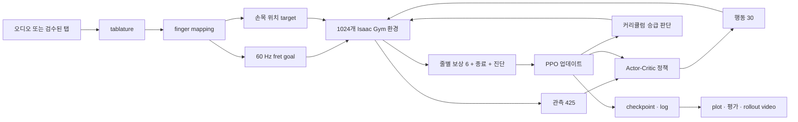
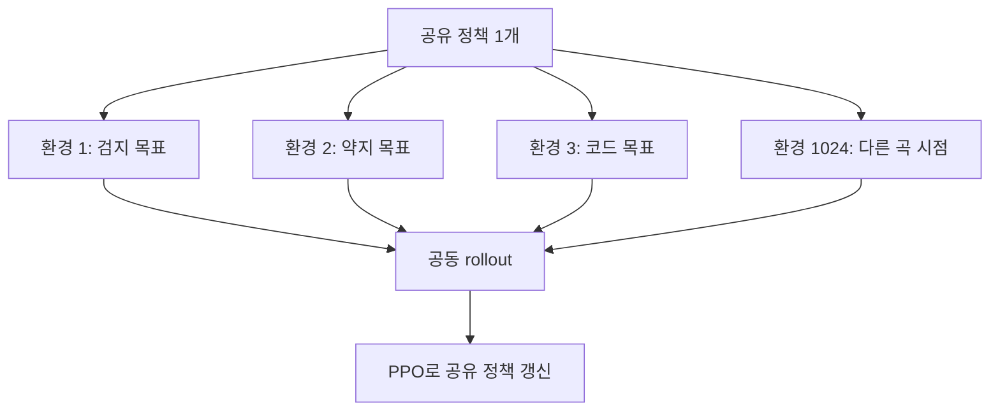
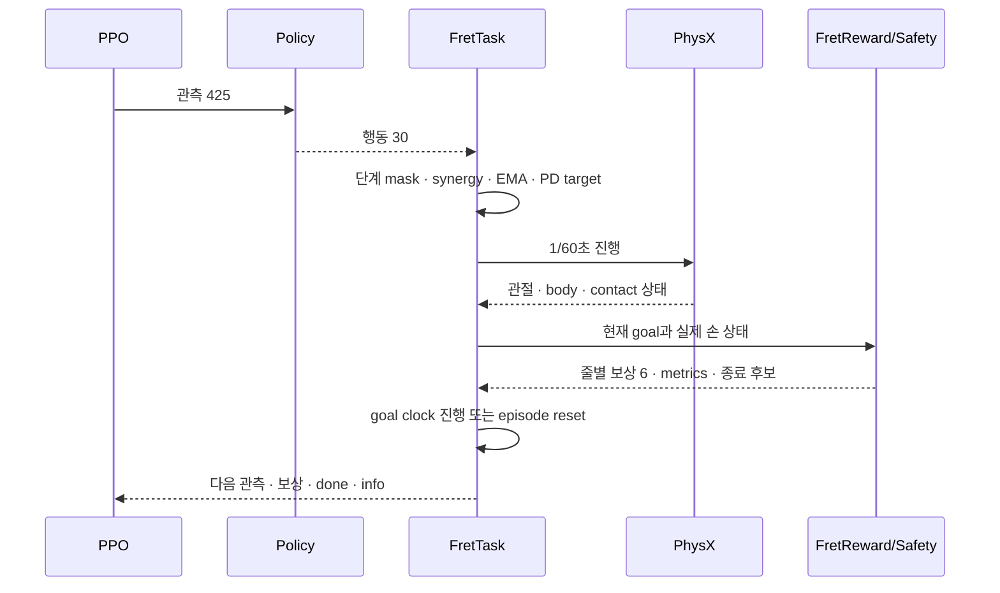
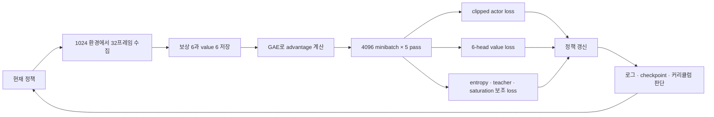

# Fret 압현 학습: 처음부터 끝까지

> **상태: HISTORICAL FRET-V1 GUIDE.** 아래 425D MLP 설명은 학습 개념과 과거 선택 근거를
> 이해하는 용도로만 보존한다. 현재 Fret-v2 실행 계약은 [`03_training/README.md`](../03_training/README.md)와
> [`../../docs/archive/dated/2026-09-16/fret_학습_상세.txt`](../../docs/archive/dated/2026-09-16/fret_%ED%95%99%EC%8A%B5_%EC%83%81%EC%84%B8.txt)를 따른다.

최종 점검일: 2026-09-02
대상: 고정 기타에서 왼손으로 줄과 프렛을 누르는 곡별 PPO 학습

이 문서는 현재 fret 학습이 무엇을 입력받고, 정책이 무엇을 보고 움직이며,
어떻게 보상을 받고 개선되는지를 처음부터 끝까지 설명한다. 처음 접하는
사람이 전체 흐름을 잡는 것이 목적이다. 함수별 세부 구현은
[FRET_CODE_ARCHITECTURE.md](FRET_CODE_ARCHITECTURE.md)를 참고한다.

빠르게 전체만 보고 싶다면 1~3절과 25절을 읽는다. 환경과 PPO를 이해하려면
7~14절, 커리큘럼을 이해하려면 15~19절, 실제 운영은 20~24절을 보면 된다.

## 1. 먼저 알아야 할 결론

현재 연구는 **새로운 곡을 즉시 연주하는 범용 모델**을 만드는 것이 아니다.
한 곡에서 만든 목표를 같은 정책이 여러 번 연습하면서, 그 곡을 정확하고
자연스럽게 누르는 모션을 찾는다.

현재 실행 계약은 다음과 같다.

| 항목 | 현재 값 | 의미 |
|---|---:|---|
| 병렬 환경 | 기본 1024개 | 같은 정책이 서로 다른 연습 구간을 동시에 경험한다. |
| 제어 주기 | 60 Hz | 1초에 60번 행동과 물리를 갱신한다. |
| PhysX substep | 4회 | 한 제어 프레임 안에서 물리를 네 번 나눠 푼다. |
| 정책 관측 | 425차원 | 몸 상태, 현재·미래 목표, 이전 행동, 엄지 상태를 본다. |
| 정책 행동 | 30차원 | 왼쪽 어깨부터 손가락까지 제어한다. |
| 보상·가치 | 6차원 | 보상 요소 6개가 아니라 기타의 여섯 줄 채널이다. |
| 기본 준비시간 | 1초 | 곡 시간을 멈춘 채 첫 목표에 접근한다. |
| 학습 방법 | PPO | 수집한 경험으로 같은 정책을 반복 갱신한다. |

`L_Thorax`의 3개 관절은 2026-09-01부터 정책 행동에서 제외했다. 초기 자세의
PD 목표를 유지한다. 따라서 이전 33-action checkpoint는 현재 30-action
정책과 호환되지 않는다.

## 2. 전체 흐름을 한 장으로 보기



중요한 경계가 있다.

- 학습 코드는 오디오를 직접 듣지 않는다.
- 직접 입력은 `fret_training.json`과 선택적
  `hand_position_targets.json`이다.
- 오디오는 학습이 끝난 영상을 원곡과 합칠 때만 다시 사용한다.
- 커리큘럼은 임의의 새로운 운지를 만들지 않는다. 선택한 곡에 실제로
  등장하는 손가락 목표, 코드, 전환을 다시 표본화한다.

## 3. 용어부터 구분하기

| 용어 | 이 프로젝트에서의 의미 |
|---|---|
| control frame | 물리와 정책이 한 번 진행되는 1/60초 |
| environment | 기타와 사람을 하나씩 가진 독립 시뮬레이션 복제본 |
| episode | 한 환경이 준비시간과 지정 연습 구간을 수행한 뒤 reset되기까지 |
| rollout | PPO가 업데이트 전에 모으는 연속 경험 묶음 |
| PPO iteration | rollout 수집과 정책 업데이트를 한 번 완료한 단위 |
| epoch | 터미널에서 PPO iteration을 쉽게 부르는 이름 |
| curriculum stage | 현재 정책이 집중해서 연습하는 난이도와 표본 방식 |
| goal | 지금과 미래에 어느 줄·프렛을 어느 손가락으로 누를지 담은 정답 |
| observation | 정책이 한 순간에 받는 숫자 벡터 |
| action | 정책이 30개 관절에 보내는 정규화된 목표 값 |
| reward | 현재 움직임이 목표와 얼마나 맞는지 나타내는 학습 신호 |

가장 자주 생기는 오해는 `epoch`이다. 화면의 `epoch 1000/10000`은 곡을
1000번 완주했다는 뜻이 아니다. 기본 설정에서 한 epoch은 다음 작업이다.

```text
1024 환경 × 32 control frame = 32,768 transition 수집
→ 같은 rollout을 5회 minibatch 학습
→ 정책 1회 갱신
```

실제 episode 수와 곡 완주 수는 로그의 별도 항목으로 기록한다.

## 4. 학습 입력은 어떻게 만들어지는가

### 4.1 곡 번들

표준 곡 입력은 다음 구조를 사용한다.

```text
data/song_bundles/<song_id>/
├── source/audio.wav
├── mapping/fingering.json
└── training/
    ├── fret_training.json
    └── hand_position_targets.json
```

- `audio.wav`: 원곡과 최종 영상을 합칠 때 사용한다.
- `fingering.json`: 각 음에 배정된 손가락과 press/release 시점을 담는다.
- `fret_training.json`: 60 Hz마다 줄·프렛·손가락 목표를 담는다.
- `hand_position_targets.json`: 기타 로컬 좌표의 손목 soft target이다.

`--song <song_id>`를 주면 해당 번들의 목표를 사용한다. `--goal`을 주면 번들
밖의 목표 JSON도 사용할 수 있다. 둘은 동시에 사용할 수 없다.

### 4.2 줄별 목표의 세 상태

각 줄과 프렛은 다음 세 상태로 해석한다.

| 상태 | 의미 |
|---|---|
| `PRESS` | 지정 손가락으로 반드시 눌러야 한다. |
| `NO_PRESS` | 누르면 오압현이다. |
| `DONT_CARE` | 음향 판정에는 영향이 없다. 물리 안전은 계속 적용한다. |

예를 들어 4번 프렛을 눌러야 한다면 0~12프렛의 의미는 다음과 같다.

```text
DC / DC / DC / DC / PRESS / NP / NP / NP / NP / NP / NP / NP / NP
```

같은 줄에서 여러 프렛이 눌리면 기타 바디 쪽의 높은 번호 프렛이 실제 음을
결정한다. 따라서 목표보다 낮은 프렛은 `DONT_CARE`, 목표보다 높은 프렛은
`NO_PRESS`로 본다.

입력 값은 다음처럼 변환된다.

- `fret > 0`: 해당 프렛은 PRESS, 위쪽 프렛은 NP, 아래쪽은 DC
- `fret == -1`: 해당 줄의 모든 프렛은 NP
- `fret == 0`: 해당 줄의 음향 판정은 DC

내부 줄 순서는 `0=high-e`, `5=low-E`다. 다른 전처리 CSV의 줄 번호 규약과
다를 수 있으므로 입력 생성 단계에서 반드시 확인한다.

### 4.3 손가락별 미래 이벤트

정책은 현재 목표만 보지 않는다. 네 손가락마다 다음 13차원 정보를 받는다.

```text
다음 줄 mask 6
+ 다음 fret 1
+ 다음 목표까지 시간 1
+ 다음 목표 유효 여부 1
+ 현재 역할 변경까지 시간 1
+ KEEP / MOVE / REST one-hot 3
= 13차원
```

이 정보로 정책은 다음 행동을 구분할 수 있다.

- `KEEP`: 현재 압현을 유지한다.
- `MOVE`: 현재 위치를 해제하고 다음 위치로 이동한다.
- `REST`: 줄을 누르지 않고 가까운 곳에서 준비한다.

바레 확장을 위해 다음 줄을 6차원 mask로 표현한다. 다만 현재 기본 학습
범위인 S0는 오픈 코드와 일반 단일 압현을 위한 단계다. 한 손가락의 다중 줄
압현과 암묵 바레를 입력 단계에서 거부한다.

## 5. 학습 명령을 실행하면 일어나는 일

기본 신규 학습 명령은 다음과 같다.

```bash
cd /home/ajou/yigyu/3/tab2body
conda activate rl38
python train.py --task fret --iterations 10000 --num-envs 1024
```

현재 환경은 NVIDIA CUDA GPU와 Isaac Gym을 전제로 한다. CPU PhysX fallback은
지원하지 않으므로 `--device cpu`로는 실행할 수 없다.

실행은 다음 순서로 진행된다.

1. `train.py`가 `--task fret`만 먼저 읽는다.
2. 실제 실행 본체인 `train_fret.py`를 지연 import한다.
3. 곡 번들, goal, 손목 target과 각 파일의 hash를 확인한다.
4. GPU VRAM, RAM, disk, 환경 수를 사전 검사한다.
5. Isaac Gym에 사람·기타·의자를 1024세트 만든다.
6. 목표 JSON을 GPU tensor로 옮기고 연습용 catalog를 만든다.
7. `ActorCritic(관측 425, 행동 30, 가치 6)`을 만든다.
8. PPO trainer와 checkpoint 계약을 만든다.
9. 신규 정책의 초기 자세, 손가락 굽힘 탐색, 엄지 탐색을 설정한다.
10. 첫 커리큘럼 단계부터 rollout과 PPO 업데이트를 반복한다.

빠른 배관 검증은 다음 명령을 쓴다.

```bash
python train.py --task fret --smoke --num-envs 8
```

`--smoke`는 환경을 최대 8개, 학습을 1 iteration으로 줄인다. 장기 학습 전에
차원, 에셋, CUDA, goal 계약이 맞는지 확인할 때 사용한다.

## 6. 1024개 환경은 무엇을 하는가

1024개 환경이 서로 다른 정책을 학습하는 것은 아니다. 모든 환경이 하나의
정책을 공유한다. 각 환경은 현재 커리큘럼이 정한 분포에서 서로 다른 목표
구간을 뽑아 동시에 경험한다.



환경은 비동기적으로 끝난다. 어떤 환경이 먼저 종료되면 그 환경만 reset하고
새 목표를 뽑는다. 나머지 환경은 진행 중인 episode를 계속한다.

초기 커리큘럼도 모든 환경이 곡의 첫 프레임에서 시작하지 않는다. 각 단계의
catalog에서 실제 단일 압현, 코드, 전환 구간을 직접 뽑는다. 후기의 일반
random start는 다음처럼 변한다.

| 단계 | 일반 random-start 동작 |
|---|---|
| `coverage` | 100% 무작위 곡 시점 |
| `integration` | 100%에서 0%로 감소 |
| `full_song` | 0%, 항상 곡 처음 |

`--no-random-start`는 후기 전곡 random start를 끈다. 초기 연습 catalog의
목표 구간 표집까지 없애지는 않는다. 처음부터 전체곡만 실행하려면
`--curriculum-stage full_song` 또는 `--no-curriculum --no-random-start`를
사용한다. `--no-curriculum`만 쓰면 기본 random start는 그대로 남는다.

## 7. 정책은 무엇을 보는가: 관측 425차원

관측은 다음 다섯 묶음이다.

| 구간 | 차원 | 정책이 얻는 정보 |
|---|---:|---|
| 기본 신체 상태 | 180 | 비고정 관절 위치·속도 162 + 기타 로컬 신체점 18 |
| 현재·근미래 goal | 128 | 0/0.1/0.25초 목표 75 + 손가락 이벤트 52 + 곡 phase 1 |
| 이전 EMA 행동 | 30 | 실제 actuator가 기억하는 직전 행동 |
| 엄지 상태 | 12 | 엄지 위치 6 + 넥 후면 거리·영역·접촉 6 |
| 장기 미래 문맥 | 75 | 0.5/1.0/1.5초 뒤 목표, 각 25차원 |
| **합계** | **425** | |

기본 신체점은 손목, 손바닥, 검지·중지·약지·소지 손끝이다. 모두 기타 로컬
좌표로 바꿔 관측한다. 기타의 월드 위치가 바뀌더라도 같은 의미를 유지하기
위한 구조다.

각 25차원 goal chunk는 다음과 같다.

```text
줄별 fret 6
+ 줄별 finger 6
+ 줄별 barre 6
+ hand anchor fret 1
+ 허용 fret 범위 2
+ 손목 target xyz 3
+ 상대 시간 1
= 25차원
```

현재, 0.1초 뒤, 0.25초 뒤의 짧은 문맥과 0.5초, 1.0초, 1.5초 뒤의 긴
문맥을 함께 본다. 정책은 이 정보를 이용해 현재 음을 유지하면서 다음
손가락 모양을 미리 준비할 수 있다.

## 8. 정책은 무엇을 움직이는가: 행동 30차원

| 그룹 | 차원 | 내용 |
|---|---:|---|
| 왼쪽 어깨 | 3 | xyz 회전 |
| 왼쪽 팔꿈치 | 3 | xyz 회전 |
| 왼쪽 손목 | 3 | xyz 회전 |
| 엄지 | 5 | 첫 관절 xyz + 두 후속 굽힘 관절 |
| 검지 | 4 | MCP 굽힘·측면, PIP, DIP |
| 중지 | 4 | MCP 굽힘·측면, PIP, DIP |
| 약지 | 4 | MCP 굽힘·측면, PIP, DIP |
| 소지 | 4 | MCP 굽힘·측면, PIP, DIP |
| **합계** | **30** | |

정책의 원시 행동은 `[-1, 1]` 범위다. 환경은 이를 다음 순서로 물리에
적용한다.

1. 현재 단계에서 허용하지 않은 관절 행동을 제한한다.
2. 비활성 인접 손가락에 작은 굽힘 동조를 조건부로 더한다.
3. 이전 행동과 새 행동을 EMA 0.5로 섞는다.
4. 값을 관절의 허용 범위 안 PD target으로 변환한다.
5. PD torque를 관절 torque 한계 안에서 계산한다.
6. PhysX를 1/60초 진행한다.

하체와 연구 범위 밖 관절은 정책이 제어하지 않는다. `L_Thorax`는 hard
lock으로 매 프레임 덮어쓰지 않고, 초기 PD target을 유지해 접촉 반력을
받으면서도 몸통 자세가 크게 흐트러지지 않게 한다.

`L_Thorax`의 위치와 속도는 기본 신체 관측에는 남는다. 정책이 직접 명령하지
않더라도 어깨의 기준 자세가 얼마나 변했는지는 볼 수 있다.

현재는 사람 손 데이터로 만든 관절 프로필을 **실제 PhysX hard limit**으로
기본 적용한다. 프로필은 원본 XML 범위를 넓히지 않고 일부 관절 범위만 더
좁힌다. 행동과 PD target은 이 범위를 넘을 수 없다. 이 hard limit과 후기
보상의 약한 human soft-range 선호는 서로 다른 장치다.

## 9. 한 control frame 안에서 일어나는 일



코드의 실제 순서는 다음과 같다.

1. 30차원 행동에 단계별 mask와 scale을 적용한다.
2. EMA와 관절 범위를 거쳐 PD target을 만든다.
3. PhysX를 진행하고 모든 상태 tensor를 갱신한다.
4. 현재 goal과 손가락 이벤트를 읽는다.
5. 압현, 위치, 엄지, 자연스러움 보상을 계산한다.
6. 준비시간이 끝난 프레임의 정확도와 sustain 통계를 누적한다.
7. 준비가 끝난 환경의 goal clock만 한 프레임 전진시킨다.
8. 관통, 손목, 손바닥, 손가락 후면, 엄지 과힘을 검사한다.
9. 다음 관측을 만든다.
10. 정상 완주와 실패 종료를 나눈다.
11. 종료된 환경의 terminal 통계를 보존한 뒤 그 환경만 reset한다.

## 10. 환경의 압현 proxy는 어떻게 판정하는가

### 10.1 접촉 모델

이 절의 "압현 성공"은 시뮬레이션 내부의 **기하 proxy 성공**을 뜻한다.
실제 줄 진동과 소리를 시뮬레이션하지 않는다. 줄의 변형, 줄과 프렛
와이어의 실제 접촉, 최소 법선 압현력도 직접 확인하지 않는다. 손가락 표본과
줄 축을 근사한 원통 사이의 위치·침투 깊이로 판정한다.

- 네 손가락의 각 segment를 여러 점으로 표본화한다.
- 줄 축 주변의 손끝 접촉 허용 영역을 반지름 6.3 mm 원통형 pad로 근사한다.
- 표본이 목표 fret cell 안에 있는지 확인한다.
- 일반 압현은 지정 손가락의 distal fingertip 접촉만 성공으로 인정한다.
- 접촉 ON 깊이는 1.0 mm, OFF 깊이는 0.5 mm다.
- hysteresis로 접촉 경계에서 판정이 깜빡이는 것을 줄인다.

압현 성공은 요약하면 다음 조건이다.

```text
지정 손가락의 손끝이 목표 fret cell을 충분히 누름
AND 목표보다 높은 NO_PRESS fret의 오압현이 없음
AND fret 길이 방향 정규화 위치가 0.1~0.9에 있음
```

다른 손가락이 대신 누르면 성공으로 인정하지 않는다.

따라서 이 성공률은 현재 물리 근사 안에서 올바른 위치를 충분히 눌렀다는
뜻이다. 실제 기타에서 음이 깨끗하게 났다는 음향적 검증과는 구분해야 한다.

### 10.2 유효 압현 위치

현재 Fret-v2에서는 단일·다중 압현 모두 fret cell의 10%~90%를
동일한 유효 영역으로 본다. 이 영역은 binary 압현 성공의 필수
조건이며, 영역 내 특정 지점에 추가 점수를 주지 않는다. 20% 지점은
접촉 전 reach target으로는 사용할 수 있지만 압현 성공의 선호점이 아니다.

여러 손가락을 동시에 누를 때는 한 점에 모이게 하지 않는다.

- 다중 압현도 각 손가락에 동일한 10%~90% correct region을 적용한다.
- 손끝 사이 최소 간격을 고려해 목표점을 cell 안에서 분산한다.
- 분산된 접근점은 유도용이며, correct region 내의 특정 점 보너스는 없다.

이 구조는 같은 프렛의 여러 줄을 누를 때 손을 기울이거나 손가락을 서로
비켜 놓을 여지를 준다.

## 11. 보상은 어떻게 구성되는가

### 11.1 먼저 알아야 할 점

`reward: [환경 수, 6]`의 6은 보상 항목 수가 아니라 기타 줄 수다. critic도
줄마다 하나씩 총 6개의 value를 예측한다. actor는 현재 곡에서 실제로
감독되는 줄만 모아 하나의 advantage로 학습한다. 전곡에서 계속
`DONT_CARE`인 줄이 gradient를 차지하지 않게 하기 위한 구조다.

초기 단계는 줄마다 다른 신호를 유지한다. 후기의 class-balanced 단계는
PRESS와 NO_PRESS를 먼저 균형 집계한 뒤 그 결과를 6개 열에 복제하기도 한다.
그래도 모델과 checkpoint의 reward/value 계약은 항상 6차원이다.

### 11.2 PRESS 핵심 보상

연구 의도는 다음 세 부분이다.

```text
30%  목표로 접근하는 거리
50%  실제 지정 손가락 압현과 안정적인 유지
20%  좋은 fret 위치
```

현재 코드는 이를 단계에 맞게 더 세분화한다.

- 거리와 fret cell 정렬을 연속 신호로 준다.
- 압현 획득은 깊이 40%와 실제 성공 60%를 섞는다.
- hold는 0.1초에서 0.2초까지 연속 유지될수록 증가한다.
- 정밀도 gate가 아직 낮으면 접촉·hold 점수를 제한한다.
- 최종 좋은 위치 점수는 실제 압현이 성공했을 때만 준다.

따라서 `30/50/20`은 설계의 큰 비율이고, 실제 최종 reward는 단계별 gate와
보조 항목 때문에 세 숫자의 단순 합은 아니다.

### 11.3 후기 단계의 큰 비중

후기 압현 단계의 기본 혼합은 다음과 같다.

| 항목 | 비중 | 역할 |
|---|---:|---|
| 압현 task core | 0.61 | 거리, 접촉, hold, 위치 정확도 |
| 손목 target | 0.15 | 손 전체가 적절한 프렛 범위에 머무르게 함 |
| 엄지 지지 | 0.20 | 넥 뒤 접근·영역·지지를 유도 |
| 비활성 손가락 hover | 0.02 | release 후 너무 멀리 튀지 않게 함 |
| 압현 중 slip 억제 | 0.02 | 눌렀던 손끝이 옆으로 끌리지 않게 함 |
| 일반 smoothness | 0.00 | 현재 보류 |

이 밖에도 다음 신호가 조건부로 적용된다.

- 손가락 아치형 자세
- 다음 목표 접근과 현재 압현 보존
- 인접 손가락의 약한 연동
- 손가락을 우선하고 손목·팔꿈치·어깨 움직임을 점차 비싸게 하는 비용
- 사람 손 자세 reference prior
- 사람 데이터에서 만든 관절 soft range
- 성공 자세 cache의 약한 pose guide와 action teacher

### 11.4 엄지 보상

엄지 보상은 넥 뒤를 향한 접근, 허용 영역, 실제 지지를 조합한다.

```text
20% 접근 + 35% 후면 기하 + 45% 실제 지지
```

목표 손끝이 80 mm 밖에 있으면 엄지 gate가 거의 꺼지고, 25 mm 안으로
접근하면 완전히 켜진다. 손끝이 실제 압현을 시도할 때 엄지가 넥 뒤에 없는
편법을 막으면서, 먼 이동 중부터 엄지를 억지로 붙이게 하지는 않는다.

다만 현재 커리큘럼의 엄지 승급 gate는 실제 collision contact rate가 아니라
접근·후면 기하·지지를 섞은 `thumb_press_readiness >= 0.35`다. 실제 접촉과
support는 보상·진단하지만 contact rate 자체는 아직 hard 승급 조건이 아니다.
따라서 승급만으로 엄지가 매 프레임 넥에 닿았다고 해석하면 안 된다.

### 11.5 오압현과 실패

- `NO_PRESS` 위치가 실제로 눌리면 해당 줄의 core 보상을 0으로 만든다.
- 오압현에는 0.35 감점을 추가한다.
- 목표 15 mm 내 near miss는 현재 진단만 하며 보상 가중치는 0이다.
  경계 안쪽 실패에만 고정 감점을 주면 정책이 15 mm 바깥에 멈추는
  비단조 local optimum이 생겨 해당 벌점을 제거했다.
- 한 번 획득한 압현이 sustain 중 풀리면 0.25 감점한다.
- 후기 전환 단계에서 오압현이 12프레임 지속되면 episode를 종료한다.
- 안전 실패 종료는 여섯 줄 reward를 모두 `-25`로 바꾼다.

일반 reward는 단계에 따라 대체로 `[-0.8, 1]` 또는 `[-1, 1]`에서 제한된다.
그 뒤 관통과 손가락 후면 soft cost가 더해질 수 있다. 따라서 터미널의 평균
reward만으로 학습 성공을 판단하면 안 된다.

## 12. 준비시간, episode, reset

모든 episode는 기본 1초의 준비시간으로 시작한다.

- 첫 goal은 관측에 보인다.
- reward와 안전 검사는 작동한다.
- 정책은 첫 목표로 접근할 수 있다.
- 곡의 goal clock은 멈춰 있다.
- 정확도, sustain, 커리큘럼 승급 증거에는 준비 프레임을 넣지 않는다.

준비시간 이후에는 현재 단계의 연습 구간이 60 Hz로 진행된다. episode는
다음 중 하나로 끝난다.

- 지정 연습 window 또는 곡 끝에 도달한 정상 종료
- episode 시간 초과
- NaN/Inf 또는 관절 속도 폭주
- 안전 경계 위반
- 후기 단계의 지속 오압현

정상 종료와 실패 종료는 별도로 기록한다. 종료된 환경은 관절, 이전 행동,
goal, 보상 추적기, 안전 debounce, 준비시간을 초기화하고 새 episode를
시작한다.

성공 자세 cache가 허용된 단계에서는 안정적으로 누른 자세 일부를 reset
시작점이나 약한 teacher로 재사용한다. 항상 cache에서 시작하지는 않는다.
초기 자세와 새로운 상태에서 찾는 능력을 남겨 두기 위해 확률적으로만 쓴다.

## 13. 안전 규칙과 진단 규칙

### 13.1 episode를 끝내는 조건

| 조건 | 현재 처리 |
|---|---|
| action·state·obs·reward NaN/Inf | 즉시 실패 종료 |
| 관절 속도 50 rad/s 초과 | 즉시 실패 종료 |
| 손바닥 벡터가 명백히 바닥을 향함 | 3프레임 뒤 실패 종료 |
| 손목이 넓은 기타 로컬 안전 box 밖 | 3프레임 뒤 실패 종료 |
| 비엄지 손가락이 넥 뒤 한계 평면을 넘음 | soft 감점 후 심하면 종료 |
| 기타 내부 2.5 mm 이상 침투 | soft 감점 |
| 기타 내부 5 mm 이상 3프레임 또는 한 step tunneling | 실패 종료 |
| 엄지 force 또는 후면 압축이 과도함 | 3프레임 뒤 실패 종료 |
| 후기 단계에서 오압현 12프레임 지속 | 실패 종료 |

관통 검사는 정확한 삼각형 mesh signed distance가 아니다. 기타의 넥과 body를
닫힌 분석 형상으로 근사하고, 이전 위치와 현재 위치 사이도 표본화해 얇은
표면을 한 프레임에 통과하는 tunneling을 찾는다.

### 13.2 현재 진단만 하는 항목

다음은 로그에는 남지만 reward나 종료를 직접 바꾸지 않는다.

- 손가락 capsule끼리의 겹침
- 손·팔의 body별 raw contact load
- 관절 hard-limit 근접률과 torque 사용률
- `L_Thorax` 초기 자세 오차, 속도, torque 사용률
- 눌렀던 손가락이 이동 중 끌리는 pressed-drag 진단

진단 분포를 충분히 본 뒤 실제 규칙으로 승격하기 위한 항목들이다.

## 14. PPO는 어떻게 정책을 개선하는가

한 PPO iteration의 흐름은 다음과 같다.



정책 모델은 다음 구조다.

- 관측 normalization: RunningMeanStd
- actor MLP: 425 → 512 → 256 → 30
- critic MLP: 425 → 512 → 256 → 6
- 학습 중 actor: 대각 Gaussian에서 표본을 뽑고 tanh 적용
- 평가 중 actor: 평균 행동을 사용해 deterministic 실행

PPO는 과거 정책에서 너무 멀리 한 번에 변하지 않도록 clipped objective와
KL 제한을 사용한다. 현재 actor learning rate는 critic보다 작다. 안전한 초기
행동을 큰 업데이트 한 번으로 잃지 않게 하기 위한 설정이다.

한 iteration에서 수집한 32,768개 transition을 4096개씩 8 minibatch로 나눈다.
이 전체를 5번 반복해 최적화한다. 그 뒤 새 정책으로 다음 rollout을 수집한다.

## 15. 커리큘럼은 왜 필요한가

처음부터 전체곡을 주면 정책은 다음 문제를 동시에 해결해야 한다.

- 기타까지 손을 이동하기
- 지정 손가락을 굽히기
- 정확한 줄과 프렛 누르기
- 여러 손가락 모양 만들기
- 압현 유지하기
- 다음 모양으로 전환하기
- 곡 전체 흐름 유지하기

초기 무작위 정책에는 너무 어려운 조합이다. 커리큘럼은 같은 정책의 가중치를
계속 이어 가면서 표본, 허용 관절, 보상 gate, 탐색량을 단계적으로 바꾼다.
각 단계가 별도 모델은 아니다.

```mermaid
flowchart LR
    A["coarse reach"] --> B["fine reach"] --> C["isolated press"] --> D["integrated press"]
    D --> E["chord reach"] --> F["chord fine reach"] --> G["static chord"]
    G -- "실패 코드 복구" --> F
    G --> H["frozen context recovery"]
    H --> I["200-iter 무보조 settle"] --> J["고정 cohort 평가"]
    J --> K["goal pair: retention → mixed 0/1/2 → full"]
    K -- "회귀 시 rollback" --> H
    K --> L["transition window 1→3초"]
    L --> M["coverage: random 100%"]
    M --> N["integration: random 100→0%"]
    N --> O["full song"]
```



곡에 충분히 지속되는 다중 손가락 코드가 없으면 `chord_reach`,
`chord_fine_reach`, `static_chord`는 자동으로 건너뛴다.

## 16. 13개 학습 단계

| 단계 | 기본 범위 | 무엇을 배우는가 |
|---|---:|---|
| `coarse_reach` | 100~1000 | 단일 손가락이 목표에서 p90 40 mm 안으로 거칠게 접근 |
| `fine_reach` | 200~1500 | p90 10 mm, fret cell 정렬 90% 수준의 정밀 접근 |
| `isolated_press` | 300~2000 | 한 손가락의 실제 접촉, 위치 품질 0.50, 아치 품질 0.65 |
| `integrated_press` | 300~2500 | 손가락 압현을 손목·팔꿈치·어깨와 통합 |
| `chord_reach` | 300~2000 | 곡에 있는 안정 다중 손가락 손 모양에 동시 접근 |
| `chord_fine_reach` | 혼합 400~1000 | 코드별 정밀 접근과 약한 조합 집중, 다른 코드 복습 |
| `static_chord` | 400~3000 | 동시 압현, hold, NO_PRESS, chord-ready를 함께 만족 |
| `frozen_context` | 아래 별도 설명 | 정적 성공 능력을 실제 곡 문맥에서도 보존 |
| `goal_pair` | 400~8000 | 현재 목표 보존과 다음 KEEP/MOVE/REST 전환 |
| `transition_window` | 800~3000 | 실제 곡 전환 window를 1초에서 3초로 확대 |
| `coverage` | 1000 | 곡의 모든 시작 시점을 골고루 복습 |
| `integration` | 1000 | 짧은 무작위 구간을 긴 처음부터의 수행으로 통합 |
| `full_song` | 최종 단계 | 항상 곡 처음부터 끝까지 수행하며 계속 개선 |

초기 일반 단계는 최소 iteration을 지난 뒤 최근 3개의 유효 성공 window가
모두 80% 이상이어야 승급한다. 곡에 실제 등장하는 각 필수 손가락의 증거도
필요하다. 단순히 평균이 높아도 한 손가락의 표본이 없으면 승급하지 않는다.
초기 네 단계는 필수 손가락마다 최소 512 episode 증거를 요구한다.

### 16.1 `integrated_press`의 관절 해제 순서

초기에는 손가락을 중심으로 해결하고, 필요할 때만 상위 관절을 연다.

| 단계 내 iteration | 허용 범위 |
|---:|---|
| 0~99 | 목표 손가락 + 엄지 + 손목 |
| 100~199 | 위 범위 + 팔꿈치 |
| 200~299 | 위 범위 + 어깨 |
| 300 이후 | 30개 행동 전체 |

### 16.2 코드 단계의 망각 방지

`chord_fine_reach`는 한 실패 코드를 80% 집중하되 다른 코드를 20% 계속
표본화한다. 코드별 최소 256 episode를 모으고 success, 거리, 정렬을 함께
본다. `static_chord`에서 특정 조합이 실패하면 최대 세 번까지 그 조합을
다시 집중 연습한 뒤 재평가한다.

### 16.3 초기 단계가 막힐 때의 회복

초기 단일 손가락 단계에서 한 손가락만 약하면 전체를 처음부터 다시 배우지
않는다. 약한 손가락을 더 자주 뽑는 recovery block으로 들어간다.

- 한 focus block은 최소 400 iteration 유지한다.
- 약한 손가락 표본을 최대 75%까지 늘린다.
- 다른 필수 손가락도 각각 최소 15%를 유지한다.
- 이전 최고 성공률에서 5%p 이상 떨어지는 망각을 감시한다.
- 한 손가락만 계속 바꾸지 않도록 focus 횟수와 전체 block 수를 제한한다.
- 초기 recovery는 전체 최대 24 block을 소진하면 구조적 stall로 기록한다.

`integrated_press`에도 별도 400-iteration recovery block이 있다. 약한 손가락을
집중하면서 이미 배운 손가락을 같이 표본화하고, 최대 12 block까지 허용한다.
회복 표집은 손가락 하나를 배울 때 이전 손가락을 잊는 문제를 줄이기 위한
장치다.

## 17. `frozen_context`의 최신 구조

이 단계는 정적 압현을 실제 곡 문맥 관측으로 옮길 때 생기는 망각을 막는다.
이전에는 가장 약한 손가락 focus가 자주 바뀔 때 전체 환경과 승급 증거까지
초기화되어 약지·소지가 잊히는 문제가 있었다. 현재는 학습 표본과 승급
평가 표본을 분리했다.

### 17.1 두 cohort

| cohort | 환경 비율 | 역할 |
|---|---:|---|
| adaptive training | 75% | 약한 손가락을 더 뽑고 성공 자세 보조를 사용한다. |
| fixed calibration/evaluation | 25% | 손가락을 균형 표집하고 보조 없이 승급 성능을 측정한다. |

25% cohort는 완전한 held-out 검증 세트는 아니다. 이 rollout도 PPO batch에
포함되어 정책 학습에는 참여한다. 다만 cohort와 목표 분포가 고정되고,
teacher·pose guide·success-RSI를 받지 않으므로 적응형 표집에 오염되지 않은
승급 기준을 제공한다.

### 17.2 회복 단계

- 실제 곡 문맥 비율은 200 iteration warmup 뒤 800 iteration 동안 0→1로
  증가한다.
- training cohort의 표본은 단일 손가락 60%, 안정 다중 압현 30%, 전체
  coverage 10%로 섞는다.
- 초기 손가락 비중은 검지/중지/약지/소지 = 20/20/30/30%다.
- 손가락 비중은 각 20~40% 안에서만 바꾼다. 한 손가락을 완전히 굶기지 않는다.
- 500 iteration마다 완료된 training cohort 증거를 검사한다.
- 각 손가락에 press와 거리 증거가 각각 최소 1024개 필요하다.
- 모든 필수 손가락이 PRESS 70% 이상, 평균 거리 25 mm 이하를 만족해야 한다.
- 이전 최고 성공률에서 5%p 넘게 떨어진 손가락도 실패로 본다.
- 위 기준을 두 block 연속 만족해야 회복 완료다.
- 최대 8 block, 즉 최대 4000 recovery iteration을 허용한다.

성공 자세 teacher·pose guide·RSI의 강도는 가장 약한 손가락을 기준으로 줄인다.

- PRESS 50→70% 개선: 보조 1→0
- 평균 거리 50→25 mm 개선: 보조 1→0
- 두 조건 중 더 나쁜 쪽의 보조 강도를 사용

첫 통과 block 뒤 보조가 꺼지고, 다음 block에서도 통과해야 한다. 즉 보조를
받아 한 번 성공한 것만으로 회복 완료가 되지 않는다.

### 17.3 무보조 안정화와 고정 평가

회복 완료 후 200 iteration 동안 모든 보조를 끈 상태로 안정화한다. 실제
문맥 비율도 1이어야 한다. 그 뒤 기존 승급 증거를 한 번만 비우고 25% 고정
cohort의 episode만 평가 window에 넣는다.

고정 평가가 시작된 뒤 최소 1000 evaluation iteration을 확보하고, 정상 또는
완화 bridge gate를 검사한다. 4000 evaluation iteration까지도 기준을 못
만족하면 `stalled`로 기록한다.

손가락 비중을 바꿀 때는 전체 환경을 reset하지 않는다. 진행 중 episode는
끝까지 수행하고, 자연 reset되는 환경부터 새 분포를 사용한다. 평가 window도
손가락 비중 변경 때문에 지워지지 않는다.

회복이 8 block 안에 끝나지 않으면 평가로 넘어가지 않고 `stalled`가 된다.
이는 기준을 낮출 상황이 아니라 손가락 획득 구조를 다시 점검할 신호다.

## 18. `goal_pair`와 실제 전환 학습

`goal_pair`는 현재 목표 하나만 잘 누르는 정책을 시간 흐름이 있는 정책으로
바꾸는 단계다. 13차원 미래 이벤트를 실제 행동에 사용한다.

```text
retention
  → mixed level 0
  → mixed level 1
  → mixed level 2
  → full
```

- `retention`: 이미 배운 정적 압현을 우선 복습한다.
- `mixed`: 실제 전환 비율을 10%→20%→35%로 늘린다.
- `mixed` sequence 비율은 40%→50%→60%로 늘린다.
- `full`: 짧은 sequence와 일부 전곡 표본을 함께 사용한다.
- sequence의 20%는 전곡 흐름으로 뽑아 짧은 전환 과적합을 막는다.
- 손가락별 press, 거리, hold, dropout을 따로 추적한다.
- 이전에 잘하던 손가락이 두 window 연속 회귀하면 recovery로 들어간다.
- 복구에 실패하면 `full → mixed → retention → frozen_context` 방향으로
  한 단계씩 rollback할 수 있다.

다음 `transition_window`는 실제 곡 전환 구간을 1.0, 1.5, 2.0, 3.0초로
늘리고 허용 변화 수도 4, 6, 8, 12개로 높인다.

## 19. 후기 승급 기준은 무엇인가

`frozen_context`, `goal_pair`, `transition_window`, `coverage`, `integration`은
짧은 순간값이 아니라 4096 episode 단위 bridge window를 사용한다. 두 window가
연속 통과해야 한다.

| 항목 | 정상 승급 기준 |
|---|---:|
| F1 | 0.95 이상 |
| 필수 손가락 중 최저 press 성공률 | 0.90 이상 |
| NO_PRESS accuracy | 0.93 이상 |
| wrong press rate | 0.035 이하 |
| sustain hold rate | 0.95 이상 |
| sustain event success | 0.85 이상 |
| press dropout rate | 0.04 이하 |
| failure termination rate | 0.02 이하 |
| thumb press readiness | 0.35 이상 |

`frozen_context` 평가에는 손가락마다 최소 4096 PRESS frame도 필요하다. 평균
F1이 높아도 약지나 소지 증거가 부족하거나 성공률이 낮으면 통과하지 않는다.
엄지의 raw contact-rate gate는 현재 비활성이고, 표의 readiness 기하 gate만
활성이다.

최대 iteration에 도달했다고 무조건 승급하지 않는다. 완화 기준이나 단계별
hard floor와 안전 조건을 만족할 때만 `forced_advance`가 가능하다. 강제 승급
사유와 횟수는 로그와 checkpoint에 남는다.

`full_song`에 도달했다고 trainer가 자동 종료되는 것은 아니다. 마지막 단계에서
계속 개선하다가 요청한 `--iterations`가 끝나야 학습이 종료된다.

## 20. 로그를 어떻게 읽어야 하는가

터미널은 기본 10 iteration마다 핵심값만 보여 준다.

```text
epoch ... | stage=... | reward=... | p90=... | success=... | F1=... | fail=...
```

| 값 | 해석 시 주의점 |
|---|---|
| `reward` | shaping을 포함한 평균이다. 상승만으로 압현 성공을 보장하지 않는다. |
| `p90` | 활성 목표 거리의 90백분위다. 표본이 없거나 쉬운 표본이면 좋게 보일 수 있다. |
| `success` | 현재 커리큘럼의 episode 성공 정의다. 단계마다 의미가 다르다. |
| `F1` | PRESS precision과 recall의 균형이다. 손가락별 망각은 숨길 수 있다. |
| `fail` | 안전·수치·시간 초과 등 실패 종료율이다. |

학습 판단에는 다음을 함께 본다.

- 각 손가락의 성공 수 / 목표 수 / 성공률
- 각 손가락 평균·p90 목표 거리
- NO_PRESS accuracy와 wrong press rate
- sustain hold, event success, dropout
- thumb readiness와 support
- 관통·손목·손가락 후면·손바닥 종료율
- 관절 limit, torque, thorax hold 진단
- 현재 stage, 내부 phase, 평가 window 진행도와 실패 gate

터미널의 순간값보다 `logs/metrics.jsonl`의 충분한 window와 실제 분모가 더
중요하다. 예를 들어 F1이 높아도 약지 목표가 거의 없었다면 약지 학습이
완료됐다는 뜻이 아니다.

## 21. checkpoint, plot, 영상은 언제 저장되는가

기본 run은 다음 위치에 생성된다.

```text
fret/training/runs/YYYYMMDD_HHMM_<song_id>/
├── run_manifest.json
├── checkpoints/
│   └── fret_XXXXXX.pt
├── logs/
│   ├── metrics.jsonl
│   ├── training.log
│   ├── artifacts.log
│   └── sessions.jsonl
├── evaluations/
├── plots/
└── videos/
```

### 저장 주기

- checkpoint: 기본 500 iteration마다
- 상세 JSONL과 terminal log: 기본 10 iteration마다
- periodic 영상 후보: 기본 1000 iteration마다
- 마지막 checkpoint: 정상 종료, clean stall, Ctrl-C 때 저장
- RuntimeError: 가능한 마지막 완료 iteration을 저장한 뒤 오류를 다시 알림

checkpoint에는 model뿐 아니라 optimizer, iteration, 누적 sample 수,
curriculum 상태, goal sampler, 성공 pose/action cache와 계약 hash가 들어간다.
계약은 관측·행동 차원, 제어 관절 순서, goal, asset, reward, safety, config와
실행 코드까지 검사한다.

### 학습 종료 후 artifact

학습 중에는 1000 iteration마다 영상을 즉시 렌더하지 않는다. 해당 checkpoint를
queue에만 넣는다. 학습용 Isaac Gym simulator를 닫은 뒤 다음 순서로 처리한다.

1. 학습 plot 3종 생성
2. queue된 1000 단위 checkpoint 영상 생성
3. 마지막 checkpoint 영상 생성
4. MP4 인코딩 후 source PNG frame 삭제
5. 성공 경로 또는 오류를 manifest와 artifact log에 기록

따라서 학습 도중 `videos/`가 비어 있어도 정상이다. 영상 렌더 실패는 학습된
checkpoint를 무효로 만들지 않는다. RuntimeError로 학습 본체가 재발생 종료한
경우에는 자동 artifact 구간까지 도달하지 못할 수 있다.

자동 생성되는 것은 plot과 rollout video다. 정량 평가 JSON은 별도 평가 명령을
실행해야 생성된다.

## 22. 학습 종료 조건

학습은 다음 중 하나로 끝난다.

1. 요청한 `--iterations`를 모두 수행한다.
2. 제한된 복구·평가 stall이 발생한다.
3. 사용자가 Ctrl-C로 중단한다.
4. 복구할 수 없는 runtime 오류가 발생한다.

기본 설정은 초기 회복 block 소진, frozen recovery 소진, frozen 고정
평가 실패·회귀처럼 더 진행하기 전에 구조를 점검해야 하는 stall에서
checkpoint를 저장하고 clean stop한다. 이 안전 기본값을 끄고 망각 진단을
계속할 때만 `--continue-after-curriculum-stall`을 명시한다.

## 23. 자주 쓰는 명령

### 새 30-action 학습

```bash
cd /home/ajou/yigyu/3/tab2body
conda activate rl38
python train.py --task fret --iterations 10000 --num-envs 1024
```

### 등록된 다른 곡 학습

```bash
python train.py --task fret \
  --song <song_id> \
  --iterations 10000 \
  --num-envs 1024
```

### 현재 30-action checkpoint 이어서 학습

```bash
python train.py --task fret \
  --checkpoint /absolute/path/to/fret_010000.pt \
  --iterations 5000 \
  --num-envs 1024
```

`--iterations 5000`은 전체 목표를 5000으로 맞추는 것이 아니라 checkpoint의
현재 iteration 뒤에 5000회를 더 수행한다.

checkpoint가 기본 곡이 아니라면 원래 학습에 쓴 동일한 `--song <song_id>`
또는 `--goal <path>`도 함께 줘야 한다. checkpoint만 보고 곡 입력을 자동으로
바꾸지는 않는다.

사람 데이터 기반 PhysX hard limit을 잠시 끄고 원본 XML 범위와 비교하려면
`--no-human-hard-limits`를 추가한다. 기본 학습에서는 켠 상태를 권장한다.

### checkpoint 정량 평가

```bash
python train.py --task fret \
  --eval \
  --checkpoint /absolute/path/to/fret_010000.pt
```

평가는 환경 1개, random start 없음, deterministic policy로 전체곡을 실행한다.
다른 곡 checkpoint는 평가할 때도 같은 `--song` 또는 `--goal`을 함께 준다.

### 특정 단계 고정 실험

```bash
python train.py --task fret \
  --curriculum-stage frozen_context \
  --iterations 2000 \
  --num-envs 1024
```

`--curriculum-stage`는 해당 단계 안의 내부 난이도 변화는 허용하지만 다음
stage로 자동 승급하지 않게 한다.

## 24. 코드에서 어디를 보면 되는가

| 알고 싶은 내용 | 파일 | 핵심 대상 |
|---|---|---|
| 공용 실행 진입 | `tab2body/train.py` | `main`, task runner 선택 |
| fret 전체 조립 | `tab2body/train_fret.py` | `main`, callback, 평가·artifact |
| 현재 설정값 | `tab2body/cfg.py` | `FRET` |
| 물리 환경 | `tab2body/env/base.py` | `GuitarEnvBase` |
| fret 환경 한 step | `tab2body/env/tasks/task_fret.py` | `FretTask` |
| goal와 표본 추출 | `tab2body/env/goals.py` | `FretGoalSequence` |
| 압현 보상 | `tab2body/env/rewards/fret.py` | `FretReward` |
| 엄지 보상 | `tab2body/env/rewards/thumb.py` | `ThumbSupportReward` |
| 관통·안전 | `tab2body/env/safety.py` | safety monitor들 |
| 정책 모델 | `tab2body/learning/models.py` | `ActorCritic` |
| PPO 수집·업데이트 | `tab2body/learning/ppo.py` | `PPOTrainer` |
| 단계 전환 | `tab2body/learning/curriculum.py` | `FingertipApproachCurriculum` |
| checkpoint 계약 | `tab2body/learning/checkpoint_contract.py` | hash·호환성 검사 |
| plot | `tab2body/tools/plot_fret_*.py` | metrics 시각화 |
| 영상 | `tab2body/tools/record_fret_rollout.py` | deterministic rollout |

## 25. 실행 전체를 짧게 다시 정리하기

```text
1. 오디오/탭에서 finger mapping을 만든다.
2. mapping을 60 Hz 줄·프렛·손가락 goal로 바꾼다.
3. 1024개 Isaac Gym 환경이 곡의 연습 구간을 나눠 뽑는다.
4. 정책은 몸·현재 목표·1.5초 미래·엄지 상태를 425차원으로 본다.
5. 정책은 어깨부터 손가락까지 30개 관절 목표를 출력한다.
6. 환경은 EMA·PD·PhysX로 1/60초 움직인다.
7. 지정 손가락 접촉, 거리, 위치, hold, 엄지, 오압현, 안전을 계산한다.
8. 32프레임×1024환경 경험으로 PPO가 정책을 한 번 갱신한다.
9. 손가락별 증거와 고정 평가 window가 기준을 넘으면 다음 단계로 간다.
10. 단일 접근→압현→코드→문맥→전환→전체곡 순서로 같은 정책을 확장한다.
11. 500 iteration마다 checkpoint를 저장한다.
12. 학습 종료 뒤 plot과 rollout 영상을 만든다.
```

## 26. 이 결과가 의미하는 것과 의미하지 않는 것

학습 결과가 좋다는 것은 선택한 곡과 현재 물리 모델에서 다음을 함께
달성했다는 뜻이다.

- 지정 손가락이 정확한 줄과 fret cell을 누른다.
- sustain 동안 압현이 유지된다.
- 보호해야 하는 위치를 누르지 않는다.
- 엄지와 손목, 상위 관절이 허용 방식으로 움직인다.
- 관통과 명백한 비정상 자세 없이 곡을 끝낸다.

반면 다음을 자동으로 보장하지는 않는다.

- 보지 않은 새로운 곡의 즉시 연주
- 실제 줄 진동과 음색의 정확한 재현
- 진단 전용인 손가락 겹침과 접촉 하중의 완전한 해결
- 실제 사람 전체 모션 분포와 동일한 자연스러움

이 경계를 이해해야 reward 상승, F1, 영상의 자연스러움을 같은 의미로
오해하지 않는다.

## 27. 다음에 볼 문서

- 전체 코드와 함수 단위 계약:
  [FRET_CODE_ARCHITECTURE.md](FRET_CODE_ARCHITECTURE.md)
- 물리 압현 규칙:
  [02_physical_control/README.md](../02_physical_control/README.md)
- 학습 실행과 결과:
  [03_training/README.md](../03_training/README.md)
- run 디렉터리 관리:
  [training/README.md](../training/README.md)
- 실험 이력과 이미 시도한 개선:
  [FRET_EXPERIMENT_HISTORY.md](../../docs/archive/dated/2026-08-24/FRET_EXPERIMENT_HISTORY.md)

문서와 코드가 충돌하면 다음 순서로 현재 동작을 확인한다.

```text
cfg.py
→ task_fret.py / goals.py / rewards/fret.py
→ curriculum.py / ppo.py
→ train_fret.py
→ 이 문서와 과거 실험 문서
```
