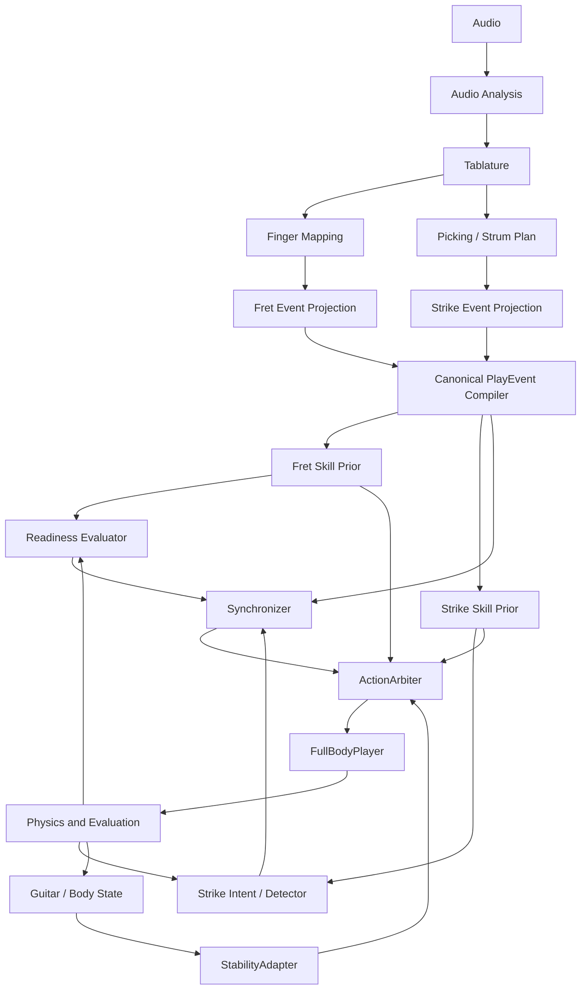

# Master Plan

> 상태: **현재 연구 구조의 설계 정본 — 구현 상태는 모듈별로 구분**
>
> 이 디렉터리는 오디오 입력부터 최종 기타 연주까지의 기준 흐름과 모듈 계약을 정리한다.
> 설계 계약의 기준 문서이며, 구현 완료 여부는 아래 상태표와 각 모듈 문서에서 별도로 기록한다.

## 기준 문서의 우선순위

계약이 아직 봉인되지 않은 동안에는 실제 코드와 자동 검증 결과를 현재 상태의 근거로 사용하고, `master_plan/`은 목표 구조로 사용한다. 계약이 승인되면 이 디렉터리의 공통 계약과 결정 기록을 새 기준으로 삼는다.

기존 `full/`은 병합 설계와 residual prototype을 보관하는 참고 영역이다. `master_plan/`과 내용이 다르면 어느 쪽을 채택할지 결정 기록에 남긴 뒤 계약을 갱신한다.

## 1. 한 줄 정의

```text
Audio
  → Tablature
  → Finger Mapping / Picking Plan
  → Canonical PlayEvent
  → Fret Skill Prior + Strike Skill Prior
  → Synchronizer
  → StabilityAdapter
  → ActionArbiter
  → FullBodyPlayer
```

최종 목표는 같은 모듈 구조와 학습 절차를 여러 곡에 적용할 수 있는 시스템이다. 다만
Fret·Strike 가중치와 FullBody bundle은 곡별로 독립 학습·저장하며, 한 곡 checkpoint를
다른 곡의 완성 정책으로 직접 사용하지 않는다.
Song bundle은 train-song/test-song으로 분할하지 않고 각 곡의 학습과 평가에 모두 사용한다.
따라서 결과는 unseen-song generalization이 아니라 song-specific performance로 보고한다.
각 곡의 주 학습은 fresh initialization에서 시작하며 다른 곡 actor를 warm-start하지 않는다.

## 2. 전체 흐름



## 3. 모듈별 기준 책임

| 모듈 | 책임 | 직접 하지 않는 일 |
|---|---|---|
| Audio Analysis | 오디오에서 음표·onset·duration·박자 후보 추출 | 관절 제어, 최종 운지 확정 |
| Tablature | 음을 기타 줄·프렛 이벤트로 표현 | 손가락 번호와 실제 관절 action 생성 |
| Finger Mapping | 왼손의 줄·프렛·손가락·압현 순서 결정 | 오른손 pick 궤적 제어 |
| Picking / Strum Plan | 오른손의 줄·방향·순서·sweep timing 결정 | 왼손 readiness 판정 |
| Canonical PlayEvent | Fret과 Strike가 공유하는 event, 시간, deadline 생성 | policy action 생성 |
| Fret | 왼손 압현 기술 prior | 기타를 안정화하거나 오른손 timing 결정 |
| Strike | 오른손 pick/strum 기술 prior | Fret-ready 판정이나 기타 지지 |
| Synchronizer | 공통 음악 시간축, readiness, event permission 관리 | 기타 지지용 관절 torque |
| StabilityAdapter | 움직이는 기타의 자세·접촉·미끄러짐 보정 | score clock 변경, 손가락 압현 대체 |
| ActionArbiter | action 소유권·mask·cap·우선순위 적용 | 새로운 음악 의미 생성 |
| FullBodyPlayer | 위 모듈의 runtime 결합 | 학습 중 계약 우회 |

## 4. 공통 원칙

- raw audio는 우선 offline 전처리 입력으로 사용한다. 물리 actor가 waveform을 직접 읽는 end-to-end 구조는 별도 연구로 분리한다.
- Fret과 Strike는 최종 정책이 아니라 해당 곡의 G0→G2 전 단계에서 재사용하는
  song-specific 기술 prior다. 재사용 단위는 곡 사이의 동일 weight가 아니라 모듈 구조와
  학습 절차다.
- FullBody runtime에서는 Fret과 Strike가 별도 event cursor를 진행하지 않고 하나의 `Canonical PlayEvent`를 공유한다. 독립 학습 환경의 task-local cursor는 학습용으로만 사용한다.
- 오른손과 왼손이 실제로 성공했는지는 policy의 의도가 아니라 physics event detector와 readiness evaluator가 판정한다.
- Synchronizer는 timing supervisor이며 일반 관절 제어기가 아니다.
- StabilityAdapter의 출력은 반드시 `ActionArbiter`를 거친다. residual을 단순 합산하지 않는다.
- 기타 안정화 보상이 압현·타현 실패를 상쇄하지 않도록 음악·안정성·안전성 지표를 분리한다.
- 관측·행동·좌표계·단위·checkpoint 계약을 먼저 고정하고 장기 학습을 시작한다.

## 5. 현재 코드와의 관계

현재 실행 코드는 다음 위치에 있다.

| 단계 | 현재 위치 | Master Plan에서의 역할 |
|---|---|---|
| 오디오→탭 | `tab2fingermapping/` | Audio Analysis, Tablature 후보 |
| 곡별 데이터 | `data/song_bundles/` | 검수된 입력·중간 산출물·학습 artifact |
| Fret physics | `tab2body/env/tasks/task_fret.py` | Fret-v2 기본 환경 + Fret-v1 호환 baseline |
| Strike physics | `tab2body/env/tasks/task_strike.py` | Strike-v1 호환 모드 + Strike-v2 기본 환경 |
| Full 계약 | `tab2body/full/` | canonical event, rule Synchronizer, source loader, 105D named action bridge (실질 가동 97D) |
| Full 연결 | `tab2body/env/tasks/task_full.py` | one-step backend 계약; 단일 Isaac Gym FullG0Task는 미구현 |
| Strap probe | `strap_sim/` | tension-only 가상 strap 제약과 시각화 검증 |

현재 기본 계약은 Fret-v2 30 action/420 observation과 Strike-v2 30 action/303
observation이다. Fret-v1 425D와 Strike-v1 327D는 명시적으로 선택하는 호환 baseline이다.
기존 `full/`의 75D/81D, Fret 428D, Strike 321D 문서는 역사적 prototype이며 현재
105D FullBody 계약에 적용하지 않는다.

FullBody의 `105D`는 관절 이름과 순서를 보존하는 named ABI 슬롯 수다. 실제로 독립적인
제어 자유도로 사용하는 관절은 zero-range인 무릎·발가락 보조축 8개를 제외한 `97D`이며,
이 8개는 초기 자세 hold 슬롯으로 남긴다.

## 6. 문서 순서

1. [범위와 설계 원칙](00_scope_and_principles.md)
2. [오디오→Tablature](01_audio_to_tablature.md)
3. [Tablature→Finger Mapping](02_tablature_to_finger_mapping.md)
4. [Fret](03_fret.md)
5. [Strike](04_strike.md)
6. [Synchronizer](05_synchronizer.md)
7. [StabilityAdapter](06_stability_adapter.md)
8. [FullBodyPlayer](07_full_body_player.md)
9. [공통 계약](08_shared_contracts.md)
10. [학습·평가·승급](09_curriculum_and_evaluation.md)
11. [확정 결정 기록과 남은 미결정 사항](10_open_decisions.md)
